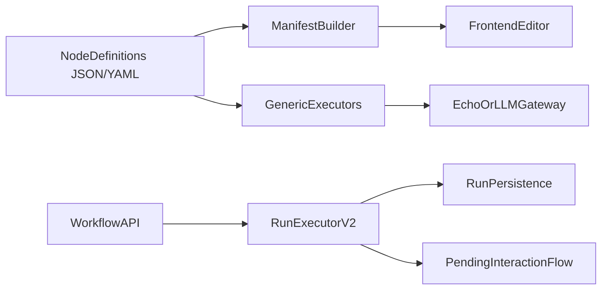

# Laravel Backend Rewrite Plan

**Goal:** Rebuild the workflow backend from scratch inside Laravel as a clean-room V2: declarative node definitions, a small executor set, backend-owned contracts, and persisted runs/human loop from day one.

## Target Shape
- Keep Laravel as the only backend/runtime.
- Treat the current implementation as reference only, not as the foundation to extend.
- Build the new system as a fresh V2 slice with new contracts and services, then cut traffic over when V2 is feature-complete for the MVP.
- Make the backend the source of truth for:
  - workflow document schema
  - node manifest/schema/defaults
  - run statuses and persisted records
  - human-loop state transitions
- Replace per-node PHP classes with declarative node definitions plus a few generic executors.

## Clean-Room Rule
- Do not incrementally simplify the existing planner/template stack.
- Do not port old node classes one by one unless they are being used only as temporary behavioral references.
- Build V2 in parallel under a new namespace / module boundary, prove it with a narrow MVP, then remove old code.

## What To Keep Only As Reference
- Use the current run/persistence paths only as design input, especially:
  - [/Volumes/Work/Workspace/AiModel/backend/app/Domain/Execution/RunExecutor.php](/Volumes/Work/Workspace/AiModel/backend/app/Domain/Execution/RunExecutor.php)
  - [/Volumes/Work/Workspace/AiModel/backend/app/Models/Workflow.php](/Volumes/Work/Workspace/AiModel/backend/app/Models/Workflow.php)
  - [/Volumes/Work/Workspace/AiModel/backend/app/Models/ExecutionRun.php](/Volumes/Work/Workspace/AiModel/backend/app/Models/ExecutionRun.php)
  - [/Volumes/Work/Workspace/AiModel/backend/app/Domain/Nodes/NodeManifestBuilder.php](/Volumes/Work/Workspace/AiModel/backend/app/Domain/Nodes/NodeManifestBuilder.php)
- Do not carry forward the Laravel-side planner/composer stack as part of the new core.
- Old code should only answer questions like:
  - which persistence concepts are worth preserving
  - which API resources the frontend already needs
  - which human-loop behaviors must still exist

## New Backend Architecture
### 1. Canonical V2 contracts first
Define one backend-owned V2 contract for:
- `WorkflowDocument`
- `WorkflowNode`
- `WorkflowEdge`
- `NodeManifest`
- `ExecutionRun`
- `NodeRunRecord`
- `PendingInteraction`
- run/node statuses

Important rule: frontend must consume these contracts directly; no parallel FE-owned schema.

### 2. Declarative nodes
Represent nodes as:
- structured definition file (`json` or `yaml`) for metadata, ports, config schema/defaults, executor kind
- prompt template file (`md` or text) when the node is prompt-driven

A node definition should carry:
- `type`, `title`, `category`, `description`
- inputs/outputs
- config schema/defaults
- executor kind
- prompt/template references
- optional human-loop settings

### 3. Small executor set
Start with 4 executors only:
- `input`
- `llm_text` or `llm_structured`
- `human_gate`
- `passthrough` / simple transform

Anything more complex should be explicitly deferred or isolated behind one special executor, not a new template class per node.

### 4. Thin runtime
Build a new `RunExecutorV2` that only does:
- document validation
- topological ordering
- input resolution
- executor dispatch
- persistence of run/node records
- pause/resume for human loop

Do not bring planner logic, provider failover complexity, or node-specific orchestration into V2.

### 4.1 New module boundary
Build V2 as a separate application slice, for example:
- `App\\WorkflowV2\\Contracts`
- `App\\WorkflowV2\\Registry`
- `App\\WorkflowV2\\Executors`
- `App\\WorkflowV2\\Runtime`
- `App\\WorkflowV2\\Http`
- `App\\WorkflowV2\\Persistence`

This keeps the rewrite honest and prevents accidental dependence on the old planner/template stack.

### 5. Human loop from day one
Keep human-loop as a first-class runtime feature, but implement it once in the runtime/executor layer instead of scattering it across many node classes.

### 6. Frontend alignment
Expose backend-driven:
- `GET /nodes/manifest`
- workflow CRUD endpoints
- run creation/status/review endpoints

Then align the frontend editor to the V2 manifest/document contract.

## Delivery Phases
### Phase 1: Contract freeze
- Define V2 document, manifest, status, and run resource shapes.
- Decide exact storage shape for workflow documents and run snapshots.
- Add compatibility notes showing what old fields are intentionally dropped.
- Define the new Laravel namespace/module boundary for V2 before writing runtime code.

### Phase 2: New declarative registry
- Create loader for node definition files.
- Create manifest builder from definitions.
- Add schema validation for definitions themselves.

### Phase 3: New runtime core
- Build validator, input resolver, and `RunExecutorV2` against V2 contracts.
- Wire generic executors.
- Support echo/mock LLM provider first.

### Phase 4: Persistence and run APIs
- Persist workflows, execution runs, node run records, pending interactions.
- Expose minimal API for create/save/run/show/review.

### Phase 5: MVP proof
- Prove one narrow end-to-end flow only:
  - create workflow
  - save workflow
  - run workflow against echo/mock executor
  - pause/resume through human loop
  - inspect persisted run data
- Do not migrate advanced nodes or planner behaviors before this proof works.

### Phase 6: Frontend adoption
- Point the editor at the V2 manifest.
- Make workflow save/load and run views consume V2 resources.
- Remove frontend assumptions that duplicate backend schema.

### Phase 7: Cutover and deletion
- Switch the frontend/API entry points to V2 only after the MVP proof is stable.
- Delete old planner/composition paths and old node template stack once V2 owns authoring + mock run + human loop.
- Archive or explicitly remove dead configs, tests, service providers, and tool wiring from the old system.

## Implementation Tasks
### Phase 1: Contracts and module skeleton
**Objective:** lock the backend-owned V2 surface before writing runtime behavior.

**Outputs:**
- V2 namespace skeleton under:
  - `backend/app/WorkflowV2/Contracts`
  - `backend/app/WorkflowV2/Registry`
  - `backend/app/WorkflowV2/Executors`
  - `backend/app/WorkflowV2/Runtime`
  - `backend/app/WorkflowV2/Http`
  - `backend/app/WorkflowV2/Persistence`
- One canonical contract document for:
  - `WorkflowDocument`
  - `WorkflowNode`
  - `WorkflowEdge`
  - `NodeManifest`
  - `ExecutionRun`
  - `NodeRunRecord`
  - `PendingInteraction`
- One canonical status set for run and node lifecycles.

**Tasks:**
- Define the V2 document field names and intentionally do not inherit old aliases like mixed edge key shapes.
- Decide whether V2 persistence uses new tables or V2-prefixed columns/resources; prefer a clean V2 schema if possible.
- Define which old runtime concepts survive conceptually:
  - workflow
  - execution run
  - node run record
  - pending interaction
- Write acceptance fixtures for one tiny workflow document and one tiny run payload.

**Phase gate:**
- Frontend and backend can both point to one written V2 contract without translation glue.

### Phase 2: Declarative node format
**Objective:** replace node classes with data definitions.

**Outputs:**
- One meta-schema for node definition files.
- Definition file directory, for example:
  - `backend/resources/workflow-v2/nodes/*.yaml`
- Prompt directory, for example:
  - `backend/resources/workflow-v2/prompts/*.md`

**Tasks:**
- Define one node definition format with:
  - metadata
  - ports
  - config schema
  - default config
  - executor kind
  - prompt/template references
  - optional human-loop settings
- Keep executor kinds to four only:
  - `input`
  - `llm_text` or `llm_structured`
  - `human_gate`
  - `passthrough`
- Create 3-4 sample definitions only for the MVP:
  - `userPrompt`
  - `scriptWriter`
  - `humanGate`
  - `finalOutput` or equivalent passthrough/output node

**Phase gate:**
- Adding a new prompt-driven node only requires a definition file and an optional prompt template.

### Phase 3: Registry and manifest
**Objective:** make the backend publish node definitions to the frontend.

**Outputs:**
- Definition loader service
- Manifest builder service
- `GET /nodes/manifest` V2 endpoint

**Tasks:**
- Load node definitions from disk and validate them against the meta-schema.
- Build one manifest shape from the validated definitions.
- Ensure config defaults and config schema are emitted directly from the backend source of truth.
- Keep manifest versioning deterministic.

**Phase gate:**
- The frontend editor can render available nodes and config forms from the V2 manifest alone.

### Phase 4: Runtime core
**Objective:** execute workflows through a thin V2 runtime only.

**Outputs:**
- `RunExecutorV2`
- `WorkflowValidatorV2`
- `InputResolverV2`
- executor dispatcher

**Tasks:**
- Validate workflow document structure and graph integrity.
- Resolve inputs from edges using only the V2 contract.
- Dispatch nodes by executor kind instead of PHP template class.
- Implement only echo/mock behavior for the LLM executor in this phase.
- Implement one centralized human-loop path instead of per-node traits/classes.

**Phase gate:**
- One narrow workflow can execute end to end without depending on any old planner/template code.

### Phase 5: Persistence and API
**Objective:** persist workflows and runs with minimal V2 endpoints.

**Outputs:**
- workflow CRUD endpoints
- run create/show/list endpoints
- review/resume endpoint for human loop
- V2 persistence models/resources

**Tasks:**
- Persist workflow documents as backend-owned V2 documents.
- Persist execution runs, node run records, and pending interactions.
- Expose run detail payloads suitable for the existing run view.
- Keep API small; do not add planner/composer endpoints.

**Phase gate:**
- A workflow can be created, saved, run, paused, resumed, and inspected entirely through V2 APIs.

### Phase 6: MVP proof and frontend hookup
**Objective:** prove the rewrite before broad migration.

**Outputs:**
- one proven end-to-end flow in the editor and run view

**Tasks:**
- Point the editor to the V2 manifest endpoint.
- Point workflow save/load to the V2 workflow endpoints.
- Point run creation/detail/review to the V2 run endpoints.
- Remove frontend assumptions that conflict with the chosen V2 contract.
- Do not migrate advanced node types yet.

**Phase gate:**
- The user can build and run one small workflow from the UI with persisted results and a working human gate.

### Phase 7: Cutover and deletion
**Objective:** remove the old system only after V2 owns the MVP path.

**Outputs:**
- old planner/composer removal
- old node template stack removal
- provider/config/test cleanup

**Tasks:**
- Switch runtime traffic to V2 only.
- Delete Laravel-side planner and Telegram composition paths.
- Delete old `NodeTemplate`-driven prompt node classes once their V2 replacements are live.
- Remove dead service-provider registrations, tool wiring, config, and tests tied to the old system.
- Keep only migration notes and archival references as needed.

**Phase gate:**
- The old planner/template architecture is absent from the active runtime path.

## Success Criteria
- A user can create a workflow from the frontend using backend-driven node metadata.
- The workflow can run end-to-end against an echo/mock LLM executor.
- Run data is fully persisted and visible in the run view.
- Human loop can pause and resume a run.
- Adding a new prompt-driven node does not require creating a new PHP template class.
- The old planner/template architecture is no longer on the runtime path.
