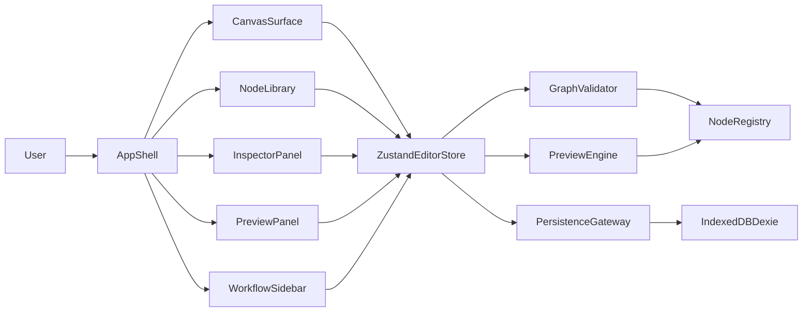
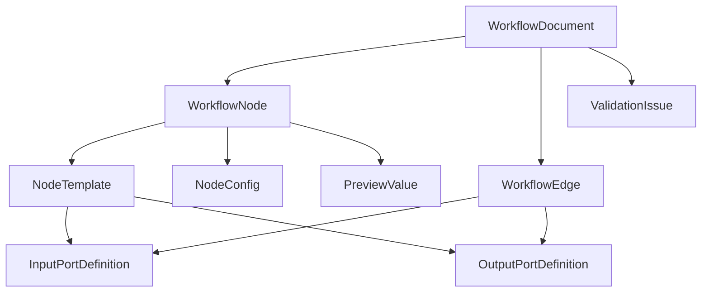

# AI Video Workflow Builder Design Proposal

## Product Thesis

This product should be a **developer-first visual composer for AI video pipelines**, not a generic automation platform. The right v1 is a fast, local-first SPA where a user can drag nodes onto a canvas, connect them, configure each node, and inspect the data contract flowing between steps. The defining experience is not "enterprise orchestration" or "production job execution". It is **thinking clearly about a video pipeline visually**.

That framing matters. If v1 tries to be a hosted automation system, it will inherit the hardest parts too early: auth, queues, provider credentials, retries, billing, asset storage, and long-running execution. Those are valuable later, but they are not the thing that proves product value. The thing that proves value is whether users can design an AI video workflow in minutes and understand what every step expects and produces.

My recommendation is therefore:

- Build **a local-first, single-user, builder-only v1**.
- Make the graph editor excellent.
- Represent every node with explicit typed inputs, outputs, config schema, and preview transforms.
- Show intermediate data clearly in the UI, even before real execution exists.
- Leave remote execution, collaboration, provider integrations, and shared asset storage for later phases.

If you do this well, you get a product that is immediately demoable, useful for design/prototyping, and technically clean enough to evolve into a real execution platform.

## 1. Vision And Scope

### What Exactly We Are Building

We are building a browser-based workflow editor for AI video creation. Users assemble a directed graph from purpose-built nodes such as `scriptWriter`, `scenePlanner`, `promptRefiner`, `imageGenerator`, `voiceoverPlanner`, and `videoComposer`. Each node exposes:

- A human-readable purpose
- A typed configuration form
- One or more input ports
- One or more output ports
- A preview transformer that shows what data shape emerges from the node

The canvas is the center of gravity. Around it sits a node library, an inspector/config panel, and a data preview panel. The user’s mental model should be: "I am designing a pipeline, and I can see what each step consumes and emits."

### V1 In Scope

V1 should include:

- Drag-and-drop node placement on a canvas
- Edge creation between compatible ports
- A curated library of video-oriented node types
- Typed node configuration forms
- Graph validation for missing required inputs, incompatible connections, and cycles
- Local persistence in the browser
- Import/export of workflow JSON
- Step-level preview data and schema inspection
- Basic workflow metadata: name, description, tags, last edited
- Undo/redo and autosave

### V1 Explicitly Out Of Scope

V1 should not include:

- Real AI execution against OpenAI, Runway, Kling, Pika, ElevenLabs, or other providers
- User accounts or multi-user collaboration
- Realtime editing
- Teams, comments, approval flows, or version branching UX
- Arbitrary scripting nodes
- Loops, conditions, retries, scheduling, or long-running jobs
- Hundreds of nodes on a single graph

This boundary is important. The product wins if it makes a 5-15 node pipeline feel obvious and trustworthy.

### Later Phases

Phase 2 should add real execution for a small curated set of nodes. Phase 3 can add cloud sync, credentials, remote runners, and asset storage. Phase 4 can add reusable subflows, templates, execution history, and lightweight collaboration.

The rule for expansion is simple: only add platform features when they directly strengthen the core workflow-design experience.

## 2. User Journeys

### Journey 1: Prototype A Short-Form Video Pipeline

A developer opens the app and lands on an empty canvas with a left sidebar of node categories: `Ideation`, `Script`, `Visuals`, `Audio`, `Video`, `Utility`. They drag in `Script Writer`, `Scene Planner`, `Image Generator`, and `Video Composer`.

They connect `Script Writer.story` to `Scene Planner.script`, then `Scene Planner.scenes` to `Image Generator.scenePlan`, and finally `Image Generator.frames` to `Video Composer.visualAssets`.

When they select `Script Writer`, the inspector shows a form with fields like `topic`, `tone`, `durationSeconds`, and `audience`. As they edit these values, the preview panel shows a sample output object for the node: title, hook, narration, and beats. Selecting `Scene Planner` shows how that output is transformed into an array of scenes with timing, shot intent, and prompt hints.

The user never runs a real AI model, but they still understand the pipeline. They can see the contracts, identify missing pieces, and export the workflow as JSON to share with a teammate or keep as a spec.

This is the core v1 success case.

### Journey 2: Diagnose A Broken Workflow

A user loads a saved workflow template called `product-launch-teaser`. One edge is highlighted red. Clicking it reveals a validation error: `VideoComposer.visualAssets expects AssetList<image>, but ImageGenerator.outputs.frames is SceneFrame[]`.

The inspector suggests the fix: insert `Asset Mapper` or change `Image Generator` output mode from `frames` to `assets`. The preview panel shows both the current output shape and the expected input shape side by side.

The user changes the node configuration and the error clears. The graph becomes valid again.

This journey is important because it demonstrates that the product is not just a drawing tool. It is a **contract-aware design environment**.

### Journey 3: Build From A Template And Fork It

A user starts from a built-in template called `NarratedStoryVideo`. The template pre-populates seven nodes, sensible defaults, and example preview data. They fork it locally, rename it, remove `Voiceover Planner`, and add `Subtitle Formatter`.

Because the app is local-first, changes autosave instantly. The user exports the workflow file and commits it into their own repo as a design artifact. They now have a repeatable visual specification for their future execution layer.

This matters commercially because templates make the product useful before provider integrations exist.

## 3. System Architecture

### Architecture Recommendation

Use a **thin, frontend-only architecture** for v1:

- React + Vite + TypeScript for the app shell
- `@xyflow/react` for the canvas and edge system
- Tailwind CSS for styling
- Zustand for editor state and commands
- Dexie on IndexedDB for local persistence
- Zod for runtime schemas and config validation
- React Hook Form for inspector forms

This stack is fast, maintainable, and aligned with the local-first requirement. Zustand is a better fit than Redux here because the domain is highly interactive and graph-centric; you want a small command-oriented store, not ceremony. Dexie is the right persistence choice because localStorage will become brittle once workflows, preview payloads, templates, and history entries get larger.

### High-Level Components



### Responsibilities

- `AppShell`: layout, routing, global keyboard shortcuts, panel management
- `CanvasSurface`: React Flow wrapper, drag/drop, edge interactions, selection, pan/zoom
- `NodeLibrary`: searchable source of draggable node templates
- `InspectorPanel`: selected node config editor and metadata editor
- `PreviewPanel`: schema view, example data, upstream/downstream contract comparison
- `ZustandEditorStore`: canonical in-memory state plus command actions
- `GraphValidator`: DAG rules, required input checks, type compatibility checks
- `PreviewEngine`: computes derived sample outputs from node config + upstream preview inputs
- `PersistenceGateway`: load/save/import/export, autosave, migrations
- `NodeRegistry`: central catalog of available node types and their schemas

### Why This Architecture Works

It keeps the product honest. The graph and node registry become the source of truth; the UI simply renders and manipulates them. That separation gives you a clean path later to server-side execution because your domain objects are already structured and typed.

## 4. Data Model

The most important design decision is to model workflows as **typed graphs with schema-aware ports** rather than as generic nodes with opaque blobs.

### Core Entities

- `WorkflowDocument`: top-level saved workflow
- `WorkflowNode`: node instance on a canvas
- `WorkflowEdge`: connection between node ports
- `NodeTemplate`: reusable definition for a node type
- `PortDefinition`: typed input/output contract for a node template
- `NodeConfig`: instance-specific settings for a node
- `PreviewValue`: sample or derived output shown in the UI
- `ValidationIssue`: graph or config problem surfaced to the user

### Entity Relationships



### TypeScript Schema Example

```ts
export type DataType =
  | 'text'
  | 'prompt'
  | 'script'
  | 'scenePlan'
  | 'imageAssetList'
  | 'videoAsset'
  | 'audioTrack'
  | 'subtitleTrack'
  | 'json';

export interface PortDefinition {
  readonly key: string;
  readonly label: string;
  readonly direction: 'input' | 'output';
  readonly dataType: DataType;
  readonly required: boolean;
  readonly multiple: boolean;
  readonly description?: string;
}

export interface NodeTemplate<TConfig> {
  readonly type: string;
  readonly title: string;
  readonly category: 'script' | 'visuals' | 'audio' | 'video' | 'utility';
  readonly description: string;
  readonly inputs: readonly PortDefinition[];
  readonly outputs: readonly PortDefinition[];
  readonly defaultConfig: Readonly<TConfig>;
  readonly configSchema: z.ZodType<TConfig>;
  readonly buildPreview: (args: {
    config: TConfig;
    inputs: Record<string, unknown>;
  }) => Record<string, unknown>;
}

export interface WorkflowNode<TConfig = unknown> {
  readonly id: string;
  readonly type: string;
  readonly position: { readonly x: number; readonly y: number };
  readonly config: Readonly<TConfig>;
  readonly label: string;
}

export interface WorkflowEdge {
  readonly id: string;
  readonly sourceNodeId: string;
  readonly sourcePortKey: string;
  readonly targetNodeId: string;
  readonly targetPortKey: string;
}
```

### Document Shape Example

```ts
export interface WorkflowDocument {
  readonly id: string;
  readonly version: 1;
  readonly name: string;
  readonly description: string;
  readonly tags: readonly string[];
  readonly nodes: readonly WorkflowNode[];
  readonly edges: readonly WorkflowEdge[];
  readonly viewport: {
    readonly x: number;
    readonly y: number;
    readonly zoom: number;
  };
  readonly createdAt: string;
  readonly updatedAt: string;
}
```

### Recommended Persistence Model

Persist `WorkflowDocument` in IndexedDB as the primary record. Store built-in templates separately from user workflows. Treat preview values and validation issues as **derived state**, not authoritative persisted state, except optionally caching preview snapshots for faster reload.

This distinction matters because it prevents stale saved data from drifting away from the current node registry logic.

## 5. Recommended File Structure

I recommend a feature-oriented structure rather than scattering components by type. The first implementation should roughly target:

- `src/app/app.tsx`
- `src/app/providers.tsx`
- `src/app/routes.tsx`
- `src/features/workflow-canvas/components/workflow-canvas.tsx`
- `src/features/workflow-canvas/components/workflow-node.tsx`
- `src/features/workflow-canvas/store/editor-store.ts`
- `src/features/workflow-canvas/store/editor-selectors.ts`
- `src/features/node-library/components/node-library-panel.tsx`
- `src/features/node-inspector/components/node-inspector-panel.tsx`
- `src/features/preview/components/preview-panel.tsx`
- `src/features/workflows/data/workflow-db.ts`
- `src/features/workflows/data/workflow-repository.ts`
- `src/features/workflows/domain/workflow-types.ts`
- `src/features/workflows/domain/graph-validator.ts`
- `src/features/workflows/domain/preview-engine.ts`
- `src/features/node-registry/node-registry.ts`
- `src/features/node-registry/templates/script-writer.ts`
- `src/features/node-registry/templates/scene-planner.ts`
- `src/features/node-registry/templates/image-generator.ts`
- `src/features/node-registry/templates/video-composer.ts`
- `src/shared/lib/zod-helpers.ts`
- `src/shared/ui/button.tsx`
- `src/shared/ui/panel.tsx`

This layout preserves a clean boundary between domain logic, data persistence, and presentation.

## 6. Key Technical Decisions

### Decision 1: Local-First Persistence

Recommendation: use **Dexie + IndexedDB**, not localStorage.

Why: workflows quickly exceed the comfort zone of key-value string storage once you add templates, history, and preview payloads. IndexedDB also gives you better migration, indexing, and future room for asset metadata.

### Decision 2: Schema-Driven Nodes

Recommendation: every node template must define `configSchema`, `inputs`, `outputs`, and `buildPreview`.

Why: this gives you one source of truth for forms, validation, compatibility checks, and preview rendering. Without this, the product becomes a canvas with ad hoc widgets instead of a reliable workflow language.

### Decision 3: Strictly Directed Acyclic Graphs In V1

Recommendation: allow only DAGs. No loops, branches with conditions, or iterative nodes in v1.

Why: video pipelines are mostly sequential or fan-out/fan-in. Cycles complicate validation, preview propagation, and mental models without delivering enough early value.

### Decision 4: Purpose-Built Data Types

Recommendation: define a controlled set of semantic data types such as `script`, `scenePlan`, `imageAssetList`, and `videoAsset`.

Why: do not hide behind generic JSON too early. Semantic types make the product feel tailored to AI video work and make validation messages intelligible.

### Decision 5: Preview Instead Of Execution

Recommendation: v1 should implement a **preview engine**, not an execution engine.

The preview engine should:

- Produce deterministic example outputs from node config and upstream example inputs
- Surface output schemas even when sample values are incomplete
- Recompute incrementally when config or edges change

This preserves the core promise of visible transformation without dragging in model providers, async orchestration, or artifact storage.

### Decision 6: Command-Oriented Store

Recommendation: model editor mutations as explicit actions like `addNode`, `connectPorts`, `updateNodeConfig`, `duplicateSelection`, `undo`, `redo`, `loadWorkflow`.

Why: graph editors accumulate interaction complexity quickly. A command-oriented store keeps undo/redo and autosave tractable.

## 7. Example Node Template

```ts
const scriptWriterTemplate: NodeTemplate<{
  topic: string;
  tone: 'educational' | 'cinematic' | 'playful';
  durationSeconds: number;
}> = {
  type: 'scriptWriter',
  title: 'Script Writer',
  category: 'script',
  description: 'Generates a short-form video script outline.',
  inputs: [],
  outputs: [
    {
      key: 'script',
      label: 'Script',
      direction: 'output',
      dataType: 'script',
      required: true,
      multiple: false,
    },
  ],
  defaultConfig: {
    topic: 'How AI video workflows work',
    tone: 'educational',
    durationSeconds: 45,
  },
  configSchema: z.object({
    topic: z.string().min(3),
    tone: z.union([
      z.literal('educational'),
      z.literal('cinematic'),
      z.literal('playful'),
    ]),
    durationSeconds: z.number().int().min(15).max(180),
  }),
  buildPreview: ({ config }) => ({
    script: {
      title: config.topic,
      hook: `In ${config.durationSeconds} seconds, explain ${config.topic}.`,
      beats: [
        'Open with a visual hook',
        'Explain the core concept',
        'Close with the result',
      ],
    },
  }),
};
```

This is the pattern to standardize around. It is simple, typed, and extensible.

## 8. UX And Interaction Design Principles

The UI should feel like a professional design tool, not a toy canvas. I recommend a three-panel layout:

- Left: searchable node library and templates
- Center: graph canvas
- Right: inspector and preview tabs

Important interaction rules:

- Selecting a node should open configuration first, then preview second
- Validation errors should appear directly on nodes and edges, not buried in a console
- Port compatibility should be visible before drop via hover states and edge affordances
- Empty states should teach through templates, not through documentation walls
- Preview should show both **sample value** and **declared schema**

For visual hierarchy, use Tailwind with a restrained dark theme, dense but readable inspector forms, and strong edge/node states for selected, invalid, and previewed elements.

## 9. Risk And Unknowns

### Product Risks

The biggest risk is that builder-only may feel too abstract if previews are weak. If users cannot see meaningful transformations, the product will feel like diagram software. The mitigation is to invest in rich preview generation and high-quality templates.

A second risk is over-generalization. If you let arbitrary JSON dominate, the tool loses its video-specific advantage. Keep the initial node taxonomy opinionated.

### Technical Risks

React Flow can handle this use case well, but dynamic handles and restore behavior need care. Known restore timing issues around dynamic handles mean the node-port system should be mostly stable per node type in v1. Avoid user-defined dynamic ports early.

Undo/redo can also become fragile if store updates are too granular. Solve this by designing explicit command boundaries from the beginning.

### Scope Risks

The temptation to add real providers early will be strong. Resist it. Once credentials, execution logs, and file storage enter the picture, your delivery velocity drops sharply.

### Unknowns To Validate Quickly

- Which 8-12 node types are most valuable for the first templates?
- What level of preview realism is sufficient for users to trust the design?
- Do users prefer strict type enforcement or a small number of coercion helpers?
- Are exported workflow files mainly for human review or future machine execution?

These are excellent interview and prototype-testing questions.

## 10. Testing Strategy

You know the product works when three things are true:

- The canvas interactions are reliable
- The graph rules are correct
- The preview/contract system is trustworthy

### Test Pyramid

**Unit tests** should cover domain logic:

- Port compatibility
- Cycle detection
- Missing input validation
- Preview propagation
- Workflow import/export normalization
- IndexedDB repository behavior via mocked adapters

**Component tests** should cover:

- Node inspector forms
- Node rendering states
- Preview panel rendering for schemas and sample data
- Validation badges and inline errors

**End-to-end tests** should cover:

- Drag a node from library to canvas
- Connect compatible nodes
- Reject incompatible edges
- Edit node config and see preview update
- Autosave and reload workflow
- Import/export round trip

### Recommended Tooling

- Vitest for unit and component tests
- React Testing Library for UI behavior
- Playwright for end-to-end flows
- MSW only if you introduce mocked APIs later

### Concrete Acceptance Suite

At minimum, v1 should have automated coverage for these scenarios:

1. Create a valid `Script Writer -> Scene Planner -> Image Generator` graph and persist it.
2. Prevent a cycle from being introduced.
3. Display a clear error for an incompatible connection.
4. Update a node config and recompute downstream preview data.
5. Export a workflow, re-import it, and preserve structure and viewport.

### Manual QA Checklist

Also keep a short manual checklist:

- Canvas zoom, pan, and selection feel smooth
- Drag/drop works consistently on common screen sizes
- Keyboard delete, duplicate, and undo/redo behave predictably
- Error states are understandable without docs
- The app loads a saved workflow without visual jumps or broken edges

## Final Recommendation

Build the product as a **typed visual design environment for AI video pipelines**, not as an automation platform. That is the right wedge.

The winning v1 stack is:

- React + Vite + TypeScript
- `@xyflow/react`
- Tailwind CSS
- Zustand
- Dexie
- Zod
- React Hook Form
- Vitest + React Testing Library + Playwright

The winning product strategy is:

- Keep it local-first
- Keep it builder-only
- Make previews feel intelligent
- Make node contracts explicit
- Make workflows exportable artifacts

If this proposal is accepted, the next document should be a step-by-step implementation plan that turns this into a build sequence with concrete tasks and test gates.
