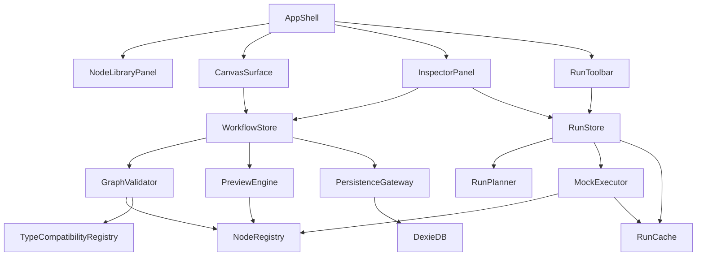

# Hybrid AI Video Builder Revision

## Honest Comparison

### Plan B vs Plan A

What `Plan B` did better than `Plan A`:

- It was more honest about the gap between “nice preview UI” and “can I actually test this pipeline.” `Plan A` stops at preview transforms; `Plan B` adds `mockExecute`, which is a much better bridge to real usage.
- It introduced an explicit execution model with per-node state (`pending`, `running`, `done`, `error`). That is materially better than Plan A’s purely static preview framing because it gives users a way to reason about step-level behavior.
- It separated state concerns more cleanly with `workflow-store` vs `execution-store`. That is better architecture than one monolithic editor store.
- It introduced a port compatibility matrix with coercion rules like `text -> text[]`. Plan A’s semantic types are directionally right, but too under-specified to be implementable without ambiguity.
- It added “Run from here,” which is one of the highest-value debugging affordances in node-based tooling.
- It added per-node fixtures, which is a better testing strategy than Plan A’s broader but less operational test guidance.

What I would adopt from `Plan B`:

- `mockExecute` on every executable node
- A first-class execution state model
- Two-store architecture: workflow/editor vs execution/runs
- Explicit compatibility/coercion rules
- Partial rerun semantics
- Node fixtures as part of the node contract

What I would not adopt as-is:

- Full end-to-end real execution in v1. That conflicts with the strongest part of Plan A’s thesis. It drags in provider, CORS, storage, and long-running orchestration too early.

### Plan C vs Plan A

What `Plan C` did better than `Plan A`:

- It was much more concrete about the node catalog. `Plan A` had the right abstraction layer but too few specific v1 node definitions.
- It introduced `ExecutionRun` as a first-class domain concept with per-node timing, which is clearly better than treating every result as ephemeral UI state.
- It added `Scene Splitter` and `Review Node`, both of which are strong product additions. `Scene Splitter` makes the pipeline materially more realistic; `Review Node` acknowledges human-in-the-loop workflows.
- It recognized the usefulness of execution artifact caching.
- It was stronger on test infrastructure with mocked providers and clear test layers.

What I would adopt from `Plan C`:

- A concrete v1 node catalog with around 10 node types
- `ExecutionRun` and `NodeRunRecord`
- Artifact/result caching, but only for mock execution in v1
- `Scene Splitter` as a core node
- `Review Node` as a non-executing pause/checkpoint node
- More explicit test fixtures and mocks

What I would not adopt as-is:

- Real provider-specific integrations in v1
- API key encryption in v1, because if there are no real providers in v1, that complexity is premature
- Retry logic and exponential backoff in node execute functions, since that belongs to real execution in v2

### Plan D vs Plan A

What `Plan D` did better than `Plan A`:

- It had the sharpest product insight besides Plan A: the Data Inspector should be the centerpiece. That is a real improvement.
- It introduced `DataPayload` wrapping `{ value, status, error, previewUrl }`, which is far more useful than Plan A’s abstract `PreviewValue`.
- It identified cancellation via `AbortController`, which is exactly the kind of practical systems thinking Plan A was missing.
- It noticed browser/CORS constraints, which matter even in a “local” app the moment execution enters the picture.
- It proposed per-node manual run, which is a better fit for builder-first tooling than “always run the whole graph.”

What I would adopt from `Plan D`:

- Data Inspector as a primary surface
- `DataPayload` semantics on port values
- Manual per-node run as the default interaction
- `AbortController` cancellation patterns
- Explicit acknowledgment that browser-only v1 mock mode avoids CORS/provider problems, while real execution later likely needs a local bridge or backend

What I would not adopt as-is:

- Embedding all inputs/outputs directly inside node data as the single source of truth. That becomes brittle; better to derive them from graph + run state while caching snapshots where useful.
- Real API access assumptions in the browser for v1.

## Best Hybrid Revisions And Why

### 1. Keep Plan A’s builder-first thesis, but upgrade “preview-only” to “preview plus mock execution”

Rationale:

`Plan A` was right that real provider execution in v1 is scope poison. But “preview only” is too weak. Users need something closer to behavior, not just static transformed examples. The best hybrid is:

- Builder-first
- Local-first
- Single-user
- No real providers in v1
- But executable in a deterministic `mock` mode

This preserves the clean scope boundary while solving the biggest weakness of Plan A.

### 2. Make the Data Inspector the product’s center of gravity

Rationale:

Plan A treated preview as a panel. Plan D correctly recognized that data visibility is the differentiator. In practice, users of AI workflow tools mostly want to answer:

- What is on this edge right now?
- Why is this node invalid?
- Why did the payload shape change?
- What exactly would the next node receive?

That means the Data Inspector should support:

- Current payload
- Declared schema
- Validation issues
- Last run result
- Upstream/downstream contract comparison
- Payload lineage

This is better than Plan A’s narrower preview concept.

### 3. Add a concrete v1 node catalog

Rationale:

Plan A’s abstractions were good, but too generic to guide implementation. Plan C was stronger here. The hybrid should define an explicit v1 catalog, for example:

- `userPrompt`
- `scriptWriter`
- `sceneSplitter`
- `promptRefiner`
- `imageGenerator`
- `imageAssetMapper`
- `ttsVoiceoverPlanner`
- `subtitleFormatter`
- `videoComposer`
- `reviewCheckpoint`
- `finalExport`

Not all nodes need mock execution to produce binary-like assets, but all should have deterministic payload contracts and inspectable results.

### 4. Split state into document state and run state

Rationale:

This is one of Plan B’s clearest wins. Plan A’s single store would blur long-lived workflow structure with transient execution state. The hybrid should have:

- `workflowStore`: nodes, edges, selection, viewport, undo/redo, metadata
- `runStore`: current run, node run records, port payload snapshots, cancellation tokens, cached mock artifacts

That separation makes persistence, undo, and crash recovery much cleaner.

### 5. Introduce first-class run entities, even in mock mode

Rationale:

Plan C’s `ExecutionRun` is better than ad hoc transient execution state. Even in mock mode, users benefit from:

- Run IDs
- Started/completed timestamps
- Per-node durations
- Node statuses
- Cached outputs
- Last successful payload per node

That improves debuggability and creates a natural evolution path to real execution later.

### 6. Add explicit port compatibility and coercion rules

Rationale:

Plan A’s semantic types are right, but insufficient. A real tool needs:

- Compatibility matrix
- Coercion rules
- Warnings vs hard errors
- Port cardinality rules
- Collection semantics

For example:

- `script -> text` allowed via extractor? no, unless adapter node present
- `text -> textList` allowed with single-item auto-wrap
- `scenePlan -> sceneList` allowed if schema shape matches version
- `imageFrameList -> imageAssetList` not automatic; requires mapper node

This makes the canvas genuinely contract-aware.

### 7. Add manual run, run-from-here, and cancel

Rationale:

These are the highest-value execution controls that do not violate the builder-first thesis:

- `Run Node`
- `Run Up To Here`
- `Run From Here`
- `Run Workflow`
- `Cancel Run`

Default interaction should be node-centric, not orchestration-centric.

### 8. Add crash recovery and import/migration rigor

Rationale:

The user’s own notes identified this gap correctly. A serious local-first app needs:

- Autosave journal
- Draft vs committed workflow snapshots
- Import validation with versioned migrations
- Recovery after tab crash during edit or run
- Clear handling of corrupted IndexedDB entries

Plan A under-specified this badly.

### 9. Keep real execution, providers, credentials, storage, polling, retries, and queues out of v1

Rationale:

Plans B/C/D all drifted toward execution platform complexity. That is exactly where the hybrid must remain disciplined. The right move is to explicitly design the interfaces so v2 can plug in a `RealExecutor`, but keep v1 shipping on a `MockExecutor`.

### 10. Strengthen UX, accessibility, and keyboard interaction

Rationale:

All plans were light here. The revised plan should specify:

- Library search
- Drag preview
- Quick-add menu
- Keyboard shortcuts
- Focus states
- Screen reader labels
- Edge/node validation badges
- Empty-state teaching
- Diff view in inspector for current vs expected contract

That turns the proposal from “architecture note” into an implementation-grade product spec.

## Git-Diff Style Changes To Plan A

```diff
diff --git a/PLAN_A.md b/PLAN_A_REVISED.md
--- a/PLAN_A.md
+++ b/PLAN_A_REVISED.md
@@
-# AI Video Workflow Builder Design Proposal
+# AI Video Workflow Builder Design Proposal
+# Revised Hybrid Specification
@@
-This product should be a **developer-first visual composer for AI video pipelines**, not a generic automation platform.
+This product should be a **developer-first visual composer and mock-execution sandbox for AI video pipelines**, not a generic automation platform.
@@
-The defining experience is not "enterprise orchestration" or "production job execution". It is **thinking clearly about a video pipeline visually**.
+The defining experience is not "enterprise orchestration" or "production job execution". It is **thinking clearly about a video pipeline visually, inspecting contracts and payloads precisely, and validating pipeline behavior safely through deterministic mock execution**.
@@
-- Show intermediate data clearly in the UI, even before real execution exists.
+- Show intermediate data clearly in the UI through a first-class Data Inspector.
+- Support deterministic mock execution for executable nodes so users can test graph behavior without real provider calls.
@@
-### V1 In Scope
+### V1 In Scope
@@
 - Typed node configuration forms
 - Graph validation for missing required inputs, incompatible connections, and cycles
 - Local persistence in the browser
 - Import/export of workflow JSON
-- Step-level preview data and schema inspection
+- Step-level preview data and schema inspection
+- Deterministic mock execution for supported nodes
+- Per-node run state, run history, and cached mock artifacts
+- Manual node execution, run-from-here, and cancel
+- First-class Data Inspector for ports, edges, node inputs, node outputs, schema, lineage, and errors
 - Basic workflow metadata: name, description, tags, last edited
 - Undo/redo and autosave
@@
-### V1 Explicitly Out Of Scope
+### V1 Explicitly Out Of Scope
@@
 - Real AI execution against OpenAI, Runway, Kling, Pika, ElevenLabs, or other providers
+- Real provider credentials and secrets management
+- Cloud queues, background workers, polling orchestration, webhook handling
+- Remote asset storage and multi-device sync
 - User accounts or multi-user collaboration
@@
-This boundary is important. The product wins if it makes a 5-15 node pipeline feel obvious and trustworthy.
+This boundary is important. The product wins if it makes a 5-15 node pipeline feel obvious, trustworthy, inspectable, and testable without introducing real execution infrastructure.
@@
-### Journey 1: Prototype A Short-Form Video Pipeline
+### Journey 1: Prototype A Short-Form Video Pipeline
@@
-The user never runs a real AI model, but they still understand the pipeline.
+The user runs the pipeline in mock mode. Each node produces deterministic payloads, statuses, timings, and artifacts that look realistic enough to validate the graph design.
@@
-### Journey 2: Diagnose A Broken Workflow
+### Journey 2: Diagnose A Broken Workflow
@@
-The preview panel shows both the current output shape and the expected input shape side by side.
+The Data Inspector shows current payload, declared schema, expected schema, coercion options, validation failures, and the last successful upstream payload side by side.
@@
+### Journey 4: Rerun From A Failed Step
+
+A user mock-runs a workflow and sees `Image Generator` fail because its `promptTemplate` config is invalid. They correct the config, click `Run From Here`, and only downstream executable nodes rerun. Upstream payload snapshots are reused from the prior run.
@@
-Use a **thin, frontend-only architecture** for v1:
+Use a **frontend-only, local-first architecture with deterministic mock execution** for v1:
@@
-- Zustand for editor state and commands
+- Zustand for workflow/editor state
+- Zustand for execution/run state
 - Dexie on IndexedDB for local persistence
 - Zod for runtime schemas and config validation
 - React Hook Form for inspector forms
+- shadcn/ui for accessible primitives layered over Tailwind
@@
-### High-Level Components
+### High-Level Components
@@
-AppShell → CanvasSurface, NodeLibrary, InspectorPanel, PreviewPanel, WorkflowSidebar
+AppShell → CanvasSurface, NodeLibrary, InspectorPanel, DataInspectorPanel, WorkflowSidebar, RunToolbar
   ↓
-ZustandEditorStore → GraphValidator, PreviewEngine, PersistenceGateway
+WorkflowStore + RunStore
   ↓
-PersistenceGateway → IndexedDB (Dexie)
-GraphValidator → NodeRegistry
-PreviewEngine → NodeRegistry
+GraphValidator → NodeRegistry + TypeCompatibilityRegistry
+PreviewEngine → NodeRegistry
+MockExecutor → NodeRegistry + RunPlanner + RunCache
+PersistenceGateway → IndexedDB (Dexie)
@@
-### Core Entities
+### Core Entities
@@
 - `PreviewValue`: sample or derived output shown in the UI
 - `ValidationIssue`: graph or config problem surfaced to the user
+- `ExecutionRun`: one mock execution attempt over part or all of a workflow
+- `NodeRunRecord`: runtime state and timing for a node during a run
+- `PortPayload`: wrapped runtime payload with status, schema metadata, and error info
+- `CompatibilityRule`: explicit typing/coercion rule between source and target ports
+- `WorkflowSnapshot`: autosave or crash-recovery snapshot
@@
-export type DataType =
-  | 'text'
-  | 'prompt'
-  | 'script'
-  | 'scenePlan'
-  | 'imageAssetList'
-  | 'videoAsset'
-  | 'audioTrack'
-  | 'subtitleTrack'
-  | 'json';
+export type DataType =
+  | 'text'
+  | 'textList'
+  | 'prompt'
+  | 'promptList'
+  | 'script'
+  | 'scene'
+  | 'sceneList'
+  | 'imageFrame'
+  | 'imageFrameList'
+  | 'imageAsset'
+  | 'imageAssetList'
+  | 'audioAsset'
+  | 'subtitleAsset'
+  | 'videoAsset'
+  | 'reviewDecision'
+  | 'json';
@@
-export interface NodeTemplate<TConfig> {
+export interface NodeTemplate<TConfig> {
   readonly type: string;
   readonly title: string;
-  readonly category: 'script' | 'visuals' | 'audio' | 'video' | 'utility';
+  readonly category:
+    | 'input'
+    | 'script'
+    | 'visuals'
+    | 'audio'
+    | 'video'
+    | 'utility'
+    | 'output';
   readonly description: string;
   readonly inputs: readonly PortDefinition[];
   readonly outputs: readonly PortDefinition[];
   readonly defaultConfig: Readonly<TConfig>;
   readonly configSchema: z.ZodType<TConfig>;
   readonly buildPreview: (args: {
     config: TConfig;
     inputs: Record<string, unknown>;
   }) => Record<string, unknown>;
+  readonly executable: boolean;
+  readonly mockExecute?: (args: MockNodeExecutionArgs<TConfig>) => Promise<Record<string, PortPayload>>;
+  readonly fixtures?: readonly NodeFixture<TConfig>[];
 }
@@
+export interface PortPayload<TValue = unknown> {
+  readonly value: TValue | null;
+  readonly status: 'idle' | 'ready' | 'running' | 'success' | 'error' | 'skipped' | 'cancelled';
+  readonly schemaType: DataType;
+  readonly errorMessage?: string;
+  readonly previewText?: string;
+  readonly previewUrl?: string;
+  readonly producedAt?: string;
+  readonly sourceNodeId?: string;
+}
+
+export interface ExecutionRun {
+  readonly id: string;
+  readonly workflowId: string;
+  readonly mode: 'mock';
+  readonly trigger: 'runWorkflow' | 'runNode' | 'runFromHere' | 'runUpToHere';
+  readonly status: 'pending' | 'running' | 'success' | 'error' | 'cancelled';
+  readonly startedAt: string;
+  readonly completedAt?: string;
+}
@@
-## 5. File Structure
+## 5. File Structure
@@
-src/
-├── app/app.tsx
-├── app/providers.tsx
-├── app/routes.tsx
-├── features/workflow-canvas/components/workflow-canvas.tsx
-├── features/workflow-canvas/components/workflow-node.tsx
-├── features/workflow-canvas/store/editor-store.ts
-├── features/workflow-canvas/store/editor-selectors.ts
-├── features/node-library/components/node-library-panel.tsx
-├── features/node-inspector/components/node-inspector-panel.tsx
-├── features/preview/components/preview-panel.tsx
-├── features/workflows/data/workflow-db.ts
-├── features/workflows/data/workflow-repository.ts
-├── features/workflows/domain/workflow-types.ts
-├── features/workflows/domain/graph-validator.ts
-├── features/workflows/domain/preview-engine.ts
-├── features/node-registry/node-registry.ts
-├── features/node-registry/templates/script-writer.ts
-├── features/node-registry/templates/scene-planner.ts
-├── features/node-registry/templates/image-generator.ts
-├── features/node-registry/templates/video-composer.ts
-├── shared/lib/zod-helpers.ts
-├── shared/ui/button.tsx
-├── shared/ui/panel.tsx
+src/
+├── app/app.tsx
+├── app/providers.tsx
+├── app/routes.tsx
+├── app/layout/app-shell.tsx
+├── features/canvas/components/workflow-canvas.tsx
+├── features/canvas/components/workflow-node-card.tsx
+├── features/canvas/components/workflow-edge.tsx
+├── features/canvas/components/run-toolbar.tsx
+├── features/node-library/components/node-library-panel.tsx
+├── features/node-library/components/node-search.tsx
+├── features/inspector/components/node-inspector-panel.tsx
+├── features/data-inspector/components/data-inspector-panel.tsx
+├── features/data-inspector/components/payload-viewer.tsx
+├── features/workflow/store/workflow-store.ts
+├── features/workflow/store/workflow-selectors.ts
+├── features/execution/store/run-store.ts
+├── features/execution/domain/run-planner.ts
+├── features/execution/domain/mock-executor.ts
+├── features/execution/domain/run-cache.ts
+├── features/workflows/data/workflow-db.ts
+├── features/workflows/data/workflow-repository.ts
+├── features/workflows/data/workflow-migrations.ts
+├── features/workflows/domain/workflow-types.ts
+├── features/workflows/domain/graph-validator.ts
+├── features/workflows/domain/type-compatibility.ts
+├── features/workflows/domain/preview-engine.ts
+├── features/workflows/domain/crash-recovery.ts
+├── features/node-registry/node-registry.ts
+├── features/node-registry/templates/user-prompt.ts
+├── features/node-registry/templates/script-writer.ts
+├── features/node-registry/templates/scene-splitter.ts
+├── features/node-registry/templates/prompt-refiner.ts
+├── features/node-registry/templates/image-generator.ts
+├── features/node-registry/templates/image-asset-mapper.ts
+├── features/node-registry/templates/tts-voiceover-planner.ts
+├── features/node-registry/templates/subtitle-formatter.ts
+├── features/node-registry/templates/video-composer.ts
+├── features/node-registry/templates/review-checkpoint.ts
+├── features/node-registry/templates/final-export.ts
+├── features/node-registry/fixtures/
+├── shared/lib/zod-helpers.ts
+├── shared/lib/ids.ts
+├── shared/lib/time.ts
+├── shared/ui/
@@
-### Decision 5: Preview Instead Of Execution
-V1 implements a preview engine, not an execution engine. Produces deterministic example outputs, surfaces schemas, recomputes incrementally.
+### Decision 5: Preview Plus Mock Execution
+V1 implements both a preview engine and a deterministic mock executor. Preview remains instant and derived; mock execution produces run records, payload snapshots, timings, and realistic fake artifacts without calling real providers.
@@
-### Decision 6: Command-Oriented Store
+### Decision 6: Command-Oriented Workflow Store + Separate Run Store
@@
-## 7. Example Node Template
+## 7. Example Node Template And Mock Execution Contract
@@
+The revised template contract includes `executable`, `mockExecute`, typed fixtures, and payload metadata.
@@
-## 8. UX Principles
+## 8. UX Principles
@@
-Three-panel layout: Left (node library + templates), Center (canvas), Right (inspector + preview tabs).
+Three-panel layout with inspector focus: Left (node library + templates + search), Center (canvas + run toolbar), Right (inspector + data inspector tabs).
@@
 - Validation errors appear directly on nodes/edges, not in a console
 - Port compatibility visible before drop via hover states
+- Every edge and port is inspectable
+- Keyboard-first editing supported throughout
+- Manual node run is as important as graph editing
+- Import, recovery, and migration errors are first-class UX states
@@
-## 9. Risk And Unknowns
+## 9. Risks, Unknowns, And Scope Controls
@@
-Technical risks: React Flow dynamic handle restore timing. Undo/redo fragility if store too granular. Solve with explicit command boundaries.
+Technical risks: React Flow handle synchronization, IndexedDB growth, mock artifact sizing, cancellation races, crash recovery correctness, type coercion confusion. Solve with explicit run model, payload contracts, bounded artifacts, and migration-tested persistence.
@@
-## 10. Testing Strategy
+## 10. Testing Strategy
@@
-Unit: port compatibility, cycle detection, preview propagation, workflow import/export.
-Component: inspector forms, node states, preview rendering, validation badges.
-E2E (Playwright): drag node, connect, reject incompatible, edit config + see preview, autosave + reload, import/export round trip.
+Unit: compatibility rules, cycle detection, run planning, payload wrapping, preview propagation, crash recovery, import/export migrations.
+Component: inspector forms, node cards, edge badges, data inspector views, run toolbar, cancellation states.
+Integration: mock execution, partial rerun, run cache reuse, recovery after simulated refresh.
+E2E (Playwright): build graph, inspect edge data, run node, run workflow, run from here, cancel run, autosave + reload, import/export round trip, recover from interrupted run.
```

## FULL Revised Plan

# AI Video Workflow Builder Design Proposal
## Revised Hybrid Specification

## Product Thesis

This product should be a **developer-first visual composer and mock-execution sandbox for AI video pipelines**, not a generic automation platform and not a premature hosted orchestration system.

The most important strategic decision is to preserve the strongest idea from the original Plan A: **the core value is helping users think clearly about an AI video pipeline visually**. The product should make pipeline structure, data contracts, payload shapes, and step-by-step transformations easy to understand. That remains the heart of the product.

However, the original Plan A was too strict in limiting v1 to preview transforms only. That approach keeps scope clean, but it undershoots user value. A static preview-only tool risks feeling like a diagram editor with nice schemas. The revised v1 should therefore go one step further without collapsing into platform complexity:

- local-first
- single-user
- browser SPA
- no real provider execution
- no auth
- no backend
- no queues
- no billing
- no remote asset storage
- but **yes to deterministic mock execution**

This hybrid gives the product a much stronger v1. Users can build a workflow, inspect its contracts, and then test its behavior safely using realistic, deterministic mock outputs. That creates a better bridge between design and future execution. It also avoids all the complexity traps that come from adding real AI providers too early.

The revised product philosophy is:

- The canvas is where users define the structure.
- The Data Inspector is where users build trust.
- Mock execution is how users validate behavior.
- Real provider execution is a later extension, not a v1 responsibility.

If this is executed well, the product will be useful immediately as:

- a workflow design tool
- a spec authoring tool
- a debugging and validation environment
- a template-driven prototyping tool
- a local artifact for teams planning future execution systems

The product should not try to prove “we can run AI video jobs in production” in v1. It should prove a narrower but stronger claim: **we can make AI video pipelines understandable, debuggable, and reusable before the hard infrastructure exists**.

---

## 1. Vision And Scope

### 1.1 What Exactly We Are Building

We are building a browser-based workflow editor for AI video creation pipelines. Users compose a directed graph from purpose-built nodes such as:

- `userPrompt`
- `scriptWriter`
- `sceneSplitter`
- `promptRefiner`
- `imageGenerator`
- `imageAssetMapper`
- `ttsVoiceoverPlanner`
- `subtitleFormatter`
- `videoComposer`
- `reviewCheckpoint`
- `finalExport`

Each node is a strongly defined contract, not a loose box with arbitrary JSON. Every node exposes:

- a human-readable purpose
- a stable node type identifier
- a category
- a typed configuration schema
- a list of input ports
- a list of output ports
- validation rules
- preview generation logic
- optional deterministic mock execution logic
- fixtures for test and demo data

The user’s mental model should be simple and consistent:

- I place steps on a canvas.
- I connect compatible outputs to inputs.
- I configure how each step behaves.
- I inspect what data a step expects and produces.
- I can mock-run one node, a branch, or the whole workflow.
- I can see exactly where a pipeline is invalid or confusing.

This is not a generic Zapier competitor, not a generic DAG runner, and not a timeline editor. It is a **logic-based non-linear editor for AI video pipelines**, where the graph represents asset generation and transformation rather than temporal sequencing.

### 1.2 The Defining Experience

The revised product’s defining experience is:

1. A user drags purpose-built nodes onto a canvas.
2. They connect only compatible ports.
3. They configure a node with a type-safe form.
4. They inspect live contracts and payloads through a first-class Data Inspector.
5. They run the graph in deterministic mock mode.
6. They understand what each step consumes, emits, and why.

That combination matters. The product should feel like a **contract-aware design environment**, not a raw node editor and not a speculative production runner.

### 1.3 V1 In Scope

V1 includes:

- Drag-and-drop node placement on a canvas
- Node library with search, categories, and drag previews
- Edge creation between compatible ports
- Strong node templates with typed config schemas
- Graph validation:
  - missing required inputs
  - incompatible types
  - invalid cardinality
  - cycles
  - orphan nodes
  - disabled nodes
- Data Inspector:
  - selected node inputs
  - selected node outputs
  - selected edge payload
  - current payload state
  - declared schema
  - expected schema
  - upstream/downstream comparison
  - validation and coercion hints
  - payload lineage
- Deterministic preview generation for every node
- Deterministic mock execution for executable nodes
- Manual per-node execution
- Run workflow
- Run from here
- Run up to here
- Cancel run
- Execution history for recent local runs
- Local persistence in IndexedDB
- Import/export of versioned workflow JSON
- Autosave
- Undo/redo
- Workflow metadata:
  - name
  - description
  - tags
  - createdAt
  - updatedAt
  - schemaVersion
- Built-in templates
- Crash recovery for unsaved edits and interrupted local runs
- Keyboard shortcuts and basic accessibility support

### 1.4 V1 Explicitly Out Of Scope

V1 does not include:

- Real provider execution against OpenAI, Runway, Kling, Pika, ElevenLabs, fal.ai, Replicate, or any external service
- API keys, secrets management, or provider credential storage
- Remote execution servers
- Queues, retries, polling, webhooks, or background jobs
- Remote asset storage
- User accounts
- Multi-user collaboration
- Realtime editing
- Team workspaces
- Comments or approval flows
- Scripting/custom code nodes
- Arbitrary plugin SDK
- Conditions, loops, retries, schedulers, or dynamic branching
- Production-grade binary media generation
- Large graphs beyond approximately 15 nodes
- Multi-tab sync guarantees
- Mobile-first UX

The scope rule is:

> If a feature primarily helps users understand and validate workflow design locally, it belongs in v1. If it primarily helps execute, scale, host, share, secure, or operationalize workflows remotely, it belongs later.

### 1.5 Product Success Criteria

V1 succeeds if a user can:

- create a 5-10 node AI video workflow in under 10 minutes
- understand every edge’s payload and schema
- identify exactly why a connection is invalid
- mock-run a pipeline and get realistic step outputs
- rerun a failed step without rerunning everything
- export the workflow as a reusable design artifact
- recover from a tab refresh or crash without losing meaningful work

V1 fails if users describe it as:

- “just a drawing tool”
- “too fake to be useful”
- “unclear what the data shape is”
- “annoying to debug”
- “half of the work is recovering from broken imports or lost state”

### 1.6 Later Phases

Phase 2 should add:

- a `RealExecutor` interface implementation
- curated provider integrations for 2-3 nodes
- local or desktop bridge for provider calls if browser-only becomes limiting
- artifact storage strategy
- long-polling abstractions for long-running generation APIs

Phase 3 should add:

- cloud sync
- optional accounts
- remote execution
- credential management
- execution logs and durable run history

Phase 4 should add:

- subflows
- template marketplace
- collaboration
- lightweight branching and version comparisons
- custom node SDK

The rule for expansion remains the same: platform features are justified only when they directly strengthen the core workflow design experience.

---

## 2. Core Product Principles

### 2.1 Builder-First, Not Platform-First

The product is a workflow builder before it is an execution platform. That means:

- UX quality beats infrastructure breadth
- clarity beats flexibility
- concrete node contracts beat generic JSON pipes
- local determinism beats remote complexity

### 2.2 Inspectability Over Magic

Every value that matters should be inspectable. The user should not wonder:

- what a node output looks like
- why a connection is failing
- whether a node ran
- what data a downstream node is seeing

If something changes, the UI should show it.

### 2.3 Strong Contracts Over Loose Wiring

Edges should not merely connect boxes. They should connect typed ports with explicit compatibility semantics. The graph is valid or invalid for specific reasons that the user can see.

### 2.4 Mockability Before Real Execution

A node is not ready for the registry until it can:

- define a schema
- define a config form
- generate preview output
- expose fixtures
- optionally mock-execute deterministically

This makes nodes testable and demoable before any real provider exists.

### 2.5 Local-First Reliability

The app should behave like a serious local tool:

- fast startup
- durable autosave
- resilient imports
- recovery after interruption
- no required internet connectivity for core usage

### 2.6 Intentional Constraint

The product should choose constraints that preserve clarity:

- DAG only
- small to medium graphs
- no arbitrary scripting
- no dynamic runtime schema mutation
- no hidden implicit conversions

### 2.7 Accessibility And Keyboard Respect

Even though this is a canvas-heavy app, the UI should not assume mouse-only interaction. Keyboard and focus behavior should be specified, not left to chance.

---

## 3. Primary User Personas

### 3.1 Solo Developer Prototyping AI Video Pipelines

This user is designing a workflow they may later implement elsewhere. They care about:

- pipeline clarity
- data contracts
- step order
- configuration shape
- exportability

They do not need hosted execution yet.

### 3.2 AI Product Engineer Validating Pipeline Structure

This user is trying to answer:

- are we missing an intermediate node?
- are these outputs compatible?
- do we need an adapter node?
- what should our future backend execute?

This user values the Data Inspector and mock execution heavily.

### 3.3 Technical Creative / Prompt Systems Designer

This user iterates on prompts, scene decomposition, subtitles, and composition structure. They care about seeing how upstream configuration changes affect downstream shapes, even if no real media is generated.

### 3.4 Team Using Workflows As Specs

Even in single-user local-first mode, exported workflow JSON can function as a design artifact in a repo. This user cares about:

- stable schemas
- import/export integrity
- readability of node types
- workflow metadata
- deterministic mock previews for demos

---

## 4. Detailed User Journeys

### 4.1 Journey 1: Create A Short-Form Video Workflow From Scratch

A user opens the app. The left sidebar shows categories:

- Input
- Script
- Visuals
- Audio
- Video
- Utility
- Output

A search field sits above the library. Typing “scene” filters the library to `Scene Splitter` and any templates mentioning scenes.

The center canvas shows an empty-state illustration with three suggested templates and a “Quick Add” affordance. The right panel is collapsed until something is selected.

The user drags in:

- `User Prompt`
- `Script Writer`
- `Scene Splitter`
- `Image Generator`
- `Video Composer`
- `Final Export`

Each node renders with:

- title
- icon
- status badge
- port handles
- small metadata row

The user connects:

- `User Prompt.prompt` -> `Script Writer.prompt`
- `Script Writer.script` -> `Scene Splitter.script`
- `Scene Splitter.scenes` -> `Image Generator.scenes`
- `Image Generator.imageAssets` -> `Video Composer.visualAssets`
- `Video Composer.videoAsset` -> `Final Export.videoAsset`

When the user selects `Scene Splitter`, the right panel opens to the Inspector tab. It shows:

- description
- config form
- input ports
- output ports
- node notes
- fixture selector for preview context

The user changes `sceneCountTarget` from `5` to `8`. The Preview tab updates instantly to show a larger scene array.

The user then switches to the Data Inspector tab and sees:

- the last computed input payload from `Script Writer`
- the current output payload for `Scene Splitter`
- declared schemas
- payload lineage
- type metadata

They click “Run Workflow (Mock).” A toolbar appears at the top of the canvas showing overall progress. Nodes animate through `pending`, `running`, `success`. The `Image Generator` mock-executes and produces inspectable asset placeholders with synthetic URLs and captions.

The user now has both a visually clear graph and a believable simulated run.

### 4.2 Journey 2: Diagnose A Broken Connection

A user loads a saved workflow. One edge is highlighted red with a warning icon.

Selecting the edge opens the Data Inspector in edge mode. The panel shows:

- source node and port
- target node and port
- source schema
- target schema
- compatibility result
- why the edge is invalid
- suggested fix options

Example:

- Source: `Image Generator.imageFrames`
- Target: `Video Composer.visualAssets`
- Result: incompatible
- Reason: `imageFrameList` is not assignable to `imageAssetList`
- Suggested fixes:
  - insert `Image Asset Mapper`
  - switch `Image Generator.outputMode` to `assets`

The user clicks the quick action to insert `Image Asset Mapper`. The app places it between the two nodes and reconnects the edges automatically if the insertion is unambiguous.

The validation error clears immediately.

### 4.3 Journey 3: Rerun From A Failed Step

A user mock-runs a workflow. `Subtitle Formatter` fails because the config requires a `maxCharsPerLine` between `12` and `42`, but the imported workflow contains `60`.

The failed node shows an error badge. The Run panel displays:

- run status: error
- failed node: `Subtitle Formatter`
- last successful upstream nodes
- elapsed time
- rerun actions

The Data Inspector shows:

- config validation failure
- old payload snapshot from upstream
- expected config constraints
- the last successful output from the previous run if available

The user changes `maxCharsPerLine` to `32` and clicks `Run From Here`. The executor computes the downstream dependency slice and reruns:

- `Subtitle Formatter`
- `Video Composer`
- `Final Export`

Upstream outputs are reused from the prior run cache for that workflow version and config hash when valid to do so.

### 4.4 Journey 4: Inspect Data On An Edge

A user wants to know exactly what is flowing from `Script Writer` to `Scene Splitter`.

They click the edge itself. The right panel switches to edge inspection mode. It shows:

- source payload
- source schema
- transport wrapper metadata
- preview rendering
- line-by-line JSON viewer
- copy payload
- compare against target schema

The user sees:

- `title`
- `hook`
- `beats`
- `cta`
- `estimatedDurationSeconds`

The target schema requires:

- `narrative`
- `beats`
- `durationSeconds`

The compatibility system explains that the connection is allowed because the node adapter extracts and normalizes `beats` and `estimatedDurationSeconds` according to the node template’s compatibility rule. If no such rule existed, the edge would be invalid.

### 4.5 Journey 5: Start From A Template And Fork It

The user starts from `Narrated Product Teaser`. The template includes:

- `User Prompt`
- `Script Writer`
- `Scene Splitter`
- `Prompt Refiner`
- `Image Generator`
- `TTS Voiceover Planner`
- `Subtitle Formatter`
- `Video Composer`
- `Final Export`

The canvas loads centered and zoomed to fit.

Each node includes example preview data and valid default config. The user removes `TTS Voiceover Planner` because they want a silent visual teaser, then reruns mock execution.

The app preserves metadata showing the workflow was created from a template but forked locally.

### 4.6 Journey 6: Recover After A Refresh

A user is editing a workflow and running a mock execution. The tab refreshes unexpectedly.

When they reopen the app, they are presented with:

- recovered draft available
- last autosave timestamp
- interrupted run detected
- restore options:
  - restore draft and mark run interrupted
  - discard recovered draft
  - open last committed workflow snapshot

This turns local-first from a slogan into a reliable editing model.

---

## 5. V1 Node Catalog

The revised v1 should define a concrete, limited, high-quality node catalog. Every node needs:

- stable type id
- config schema
- input/output schemas
- preview builder
- fixtures
- icon
- category
- optional mock execution

### 5.1 `userPrompt`

Purpose:
Collects or seeds the initial creative intent.

Category:
`input`

Inputs:
None

Outputs:
- `prompt: prompt`

Config:
- `topic: string`
- `goal: string`
- `audience: string`
- `tone: 'educational' | 'cinematic' | 'playful' | 'dramatic'`
- `durationSeconds: number`

Behavior:
Generates a structured prompt payload from simple form inputs.

Mock execution:
Not necessary as a separate async step; preview and run output can be identical.

### 5.2 `scriptWriter`

Purpose:
Transforms prompt intent into a script object.

Category:
`script`

Inputs:
- `prompt: prompt`

Outputs:
- `script: script`

Config:
- `style`
- `structure`
- `includeHook`
- `includeCTA`
- `targetDurationSeconds`

Behavior:
Produces a structured script payload with title, hook, beats, narration, and CTA.

Mock execution:
Deterministic output based on prompt and config hash.

### 5.3 `sceneSplitter`

Purpose:
Turns a script into a list of scenes.

Category:
`script`

Inputs:
- `script: script`

Outputs:
- `scenes: sceneList`

Config:
- `sceneCountTarget`
- `maxSceneDurationSeconds`
- `includeShotIntent`
- `includeVisualPromptHints`

Behavior:
Creates structured scenes with sequence index, summary, timing, shot intent, and prompt hints.

Mock execution:
Produces realistic scene arrays.

### 5.4 `promptRefiner`

Purpose:
Converts scenes into image-generation prompts or enhanced prompts.

Category:
`visuals`

Inputs:
- `scenes: sceneList`

Outputs:
- `prompts: promptList`

Config:
- `visualStyle`
- `cameraLanguage`
- `aspectRatio`
- `consistencyNotes`
- `negativePromptEnabled`

Behavior:
Produces one refined prompt per scene.

Mock execution:
Deterministic prompt expansion.

### 5.5 `imageGenerator`

Purpose:
Represents image generation per scene.

Category:
`visuals`

Inputs:
- `scenes: sceneList` or `prompts: promptList` depending on mode

Outputs:
- `imageFrames: imageFrameList`
- or `imageAssets: imageAssetList` depending on config

Config:
- `inputMode: 'scenes' | 'prompts'`
- `outputMode: 'frames' | 'assets'`
- `stylePreset`
- `resolution`
- `seedStrategy`

Behavior:
In v1, does not call a provider. Produces placeholder image artifacts with metadata.

Mock execution:
Required.

### 5.6 `imageAssetMapper`

Purpose:
Adapts raw frames into normalized asset descriptors.

Category:
`utility`

Inputs:
- `imageFrames: imageFrameList`

Outputs:
- `imageAssets: imageAssetList`

Config:
- `assetRole`
- `namingPattern`

Behavior:
Normalizes frame outputs to the composition contract.

Mock execution:
Mostly deterministic transform; can share logic with preview.

### 5.7 `ttsVoiceoverPlanner`

Purpose:
Plans voiceover segments and metadata without synthesizing actual audio.

Category:
`audio`

Inputs:
- `script: script`

Outputs:
- `audioPlan: audioAsset`

Config:
- `voiceStyle`
- `pace`
- `genderStyle`
- `includePauses`

Behavior:
Creates audio timing plan, transcript chunks, and placeholder URL.

Mock execution:
Required.

### 5.8 `subtitleFormatter`

Purpose:
Formats subtitles from script or audio plan.

Category:
`video`

Inputs:
- `script: script`
- optional `audioPlan: audioAsset`

Outputs:
- `subtitleAsset: subtitleAsset`

Config:
- `maxCharsPerLine`
- `linesPerCard`
- `stylePreset`
- `burnMode: 'soft' | 'burnedPreview'`

Behavior:
Produces subtitle segments and style metadata.

Mock execution:
Required.

### 5.9 `videoComposer`

Purpose:
Combines visual assets, optional subtitles, and optional audio plan into a composed video artifact.

Category:
`video`

Inputs:
- `visualAssets: imageAssetList`
- optional `audioPlan: audioAsset`
- optional `subtitleAsset: subtitleAsset`

Outputs:
- `videoAsset: videoAsset`

Config:
- `aspectRatio`
- `transitionStyle`
- `fps`
- `includeTitleCard`
- `musicBed: 'none' | 'placeholder'`

Behavior:
Produces a mock composed asset descriptor, timeline summary, and preview metadata.

Mock execution:
Required.

### 5.10 `reviewCheckpoint`

Purpose:
Introduces a human-in-the-loop checkpoint where the user can annotate or approve data before downstream steps.

Category:
`utility`

Inputs:
- one generic typed input constrained by configuration or a small union of supported types

Outputs:
- `approvedPayload`
- `reviewDecision`

Config:
- `reviewLabel`
- `instructions`
- `blocking: boolean`

Behavior:
Does not transform data automatically; it wraps and re-emits after user confirmation in mock mode.

Mock execution:
Can default to auto-approve in workflow-level mock runs, but should support manual review mode.

### 5.11 `finalExport`

Purpose:
Packages the output into an export descriptor.

Category:
`output`

Inputs:
- `videoAsset: videoAsset`

Outputs:
- `exportBundle: json`

Config:
- `fileNamePattern`
- `includeMetadata`
- `includeWorkflowSpecReference`

Behavior:
Produces exportable JSON descriptor and synthetic file info.

Mock execution:
Required.

### 5.12 Node Catalog Rules

A node is eligible for v1 only if it satisfies all of the following:

- solves a clear AI video workflow task
- has a stable contract
- can be previewed deterministically
- can be mocked deterministically if executable
- does not require real provider infrastructure
- improves clarity rather than increasing platform surface area

---

## 6. Information Architecture And UX

### 6.1 Primary Layout

Use a three-region app shell:

- Left: `NodeLibraryPanel`
- Center: `CanvasSurface` with `RunToolbar`
- Right: `InspectorPanel` with tabs for:
  - Config
  - Data
  - Validation
  - Metadata

Top bar:

- workflow name
- save state
- undo/redo
- import/export
- template actions
- settings

Bottom status row optional:

- selected item
- validation summary
- autosave status
- run status

### 6.2 Left Panel: Node Library

The node library should include:

- search input
- category filters
- recently used nodes
- template quick starts
- drag handles
- compact/expanded mode

Each node library item shows:

- icon
- title
- short description
- supported input/output summary

Interaction details:

- drag to canvas creates node
- click opens a detail popover
- keyboard quick-add opens a searchable command menu
- hovering a node while an edge is selected highlights compatible drop targets

### 6.3 Center Panel: Canvas

The canvas should support:

- pan
- zoom
- fit view
- grid background
- snap-to-grid optional
- selection box
- multi-select
- edge creation
- node duplication
- delete
- alignment helpers
- quick insertion on edge

Node visuals should include:

- title
- category color or icon accent
- validation badge
- run status badge
- disabled state
- compact port labels
- execution affordances where applicable

Edge visuals should include:

- default
- selected
- invalid
- warning
- carrying data
- last-run success/error indicators

### 6.4 Right Panel: Inspector

The right panel is not a generic sidebar; it is a high-value diagnostic workspace.

Modes:

- node selected
- edge selected
- workflow selected
- nothing selected

Tabs for node mode:

- `Config`
- `Data`
- `Validation`
- `Metadata`

Config tab includes:

- node title
- description
- typed form
- reset to defaults
- fixture selector
- last run summary
- run actions

Data tab includes:

- latest input payloads
- latest output payloads
- preview payloads
- schema comparison
- lineage trace
- JSON/raw view
- human-readable summary view

Validation tab includes:

- config schema issues
- missing inputs
- type mismatch issues
- warnings
- suggested remediations

Metadata tab includes:

- node id
- type
- createdAt
- updatedAt
- notes
- pinned comment

### 6.5 Data Inspector As First-Class Feature

The Data Inspector is the biggest differentiator and should be treated as a dedicated product pillar, not an afterthought.

It must support inspecting:

- node inputs
- node outputs
- selected edge payload
- workflow-level run summary
- current preview vs last run output
- schema mismatch diagnostics
- payload history for recent runs
- raw JSON and readable summary modes

For every payload shown, display:

- payload status
- schema type
- producer node
- produced timestamp
- preview text or preview URL if available
- data size estimate
- validation state

If a payload is too large, truncate intelligently and provide:

- expand
- copy
- download JSON

### 6.6 Run Toolbar

The run toolbar sits above the canvas and exposes:

- `Run Workflow`
- `Run Selected Node`
- `Run From Here`
- `Run Up To Here`
- `Cancel`
- last run status
- elapsed time
- mock mode indicator

If nothing valid is selected for node-specific actions, disable those actions with explanatory tooltips.

### 6.7 Empty States

Empty-state UX matters because templates are a major adoption strategy.

The initial state should offer:

- “Start from template”
- “Add first node”
- suggested workflows
- keyboard shortcut hints

Invalid or missing data states should avoid generic “No data.” Instead use:

- “This node has not run yet.”
- “This output is unavailable because upstream validation failed.”
- “Select an edge to inspect its payload.”
- “Run this node in mock mode to generate payloads.”

### 6.8 Accessibility

The app should provide:

- keyboard navigation between panels
- keyboard selection of nodes and edges
- focus-visible states
- labeled buttons and handles
- screen-reader labels for run status and validation counts
- reduced motion mode
- sufficient contrast in both light and dark themes

Canvas-heavy apps are difficult to make perfectly screen-reader friendly, but the inspector and library should remain highly accessible.

### 6.9 Keyboard Shortcuts

Recommended defaults:

- `Cmd/Ctrl + S`: export/save snapshot
- `Cmd/Ctrl + Z`: undo
- `Cmd/Ctrl + Shift + Z`: redo
- `Backspace/Delete`: delete selection
- `Space`: pan mode while held
- `A`: quick add node
- `Enter`: inspect selected item
- `R`: run selected node
- `Shift + R`: run workflow
- `Escape`: clear selection / close menus

---

## 7. System Architecture

### 7.1 Architecture Recommendation

Use a frontend-only architecture with deterministic mock execution.

Core stack:

- React
- Vite
- TypeScript with strict mode
- `@xyflow/react`
- Tailwind CSS
- shadcn/ui primitives
- Zustand
- Dexie
- Zod
- React Hook Form
- Vitest
- React Testing Library
- Playwright

This stack is optimized for:

- fast local iteration
- strong type safety
- canvas interactions
- offline-capable persistence
- schema-driven forms
- maintainable UI composition

### 7.2 Architectural Position

V1 architecture should intentionally separate four concerns:

1. workflow document modeling
2. graph validation and preview derivation
3. run planning and mock execution
4. persistence and recovery

This separation is crucial. It prevents the codebase from turning into a single mutable graph blob with mixed UI and runtime state.

### 7.3 High-Level Component Graph



### 7.4 Major Runtime Modules

#### `NodeRegistry`

Responsible for:

- registering node templates
- exposing node metadata
- exposing config schemas
- exposing port definitions
- exposing preview builders
- exposing mock execution handlers
- exposing fixtures

#### `GraphValidator`

Responsible for:

- cycle detection
- missing input detection
- connection validation
- config validation integration
- downstream invalidation reporting
- workflow-level validation summary

#### `TypeCompatibilityRegistry`

Responsible for:

- source-target compatibility lookup
- coercion rules
- warning vs error classification
- adapter recommendations

#### `PreviewEngine`

Responsible for:

- deterministic local preview derivation
- incremental recomputation
- fixture-aware previews
- preview invalidation on config or topology changes

#### `RunPlanner`

Responsible for:

- topological ordering
- selection-based subgraph extraction
- run-from-here planning
- run-up-to-here planning
- dependency pruning
- cache reuse eligibility

#### `MockExecutor`

Responsible for:

- invoking `mockExecute`
- managing per-node status
- wrapping outputs as `PortPayload`
- capturing timing
- recording failures
- cancellation support
- writing run records

#### `RunCache`

Responsible for:

- storing recent mock outputs
- invalidating on config/topology changes
- reusing upstream payloads during partial rerun
- bounding storage size

#### `PersistenceGateway`

Responsible for:

- load
- save
- autosave
- import
- export
- migrations
- recovery snapshots
- recent workflows listing

### 7.5 State Separation

#### `workflowStore`

Contains:

- workflow document
- selected node ids
- selected edge id
- viewport
- library UI state
- inspector tab state
- undo/redo history
- dirty state
- validation summary
- derived preview caches if kept in-memory

This store should persist document-related state only.

#### `runStore`

Contains:

- active run
- recent runs
- node run records
- payload snapshots
- cache metadata
- cancellation controllers
- run toolbar state
- last execution scope

This store should never be part of undo/redo history.

### 7.6 Why Two Stores Matter

If run state is mixed into document state:

- undo becomes polluted with runtime changes
- save/export can accidentally include transient runtime noise
- crash recovery becomes more complex
- document diffs become less meaningful

Separation creates a cleaner mental and code architecture.

---

## 8. Data Model

### 8.1 Core Design Principles

The data model should prioritize:

- versionability
- inspectability
- strict typing
- runtime metadata without polluting authoring structures
- clean separation between document and run artifacts

### 8.2 Semantic Data Types

Use semantic types rather than generic `json` whenever possible.

```ts
export type DataType =
  | 'text'
  | 'textList'
  | 'prompt'
  | 'promptList'
  | 'script'
  | 'scene'
  | 'sceneList'
  | 'imageFrame'
  | 'imageFrameList'
  | 'imageAsset'
  | 'imageAssetList'
  | 'audioAsset'
  | 'subtitleAsset'
  | 'videoAsset'
  | 'reviewDecision'
  | 'json';
```

These types are still intentionally limited. They are expressive enough for v1 without pretending to solve every future media type.

### 8.3 Port Definition

```ts
export interface PortDefinition {
  readonly key: string;
  readonly label: string;
  readonly direction: 'input' | 'output';
  readonly dataType: DataType;
  readonly required: boolean;
  readonly multiple: boolean;
  readonly description?: string;
}
```

### 8.4 Workflow Document Entities

```ts
export interface WorkflowNode<TConfig = unknown> {
  readonly id: string;
  readonly type: string;
  readonly label: string;
  readonly position: {
    readonly x: number;
    readonly y: number;
  };
  readonly config: Readonly<TConfig>;
  readonly disabled?: boolean;
  readonly notes?: string;
}

export interface WorkflowEdge {
  readonly id: string;
  readonly sourceNodeId: string;
  readonly sourcePortKey: string;
  readonly targetNodeId: string;
  readonly targetPortKey: string;
}

export interface WorkflowDocument {
  readonly id: string;
  readonly version: 2;
  readonly name: string;
  readonly description: string;
  readonly tags: readonly string[];
  readonly nodes: readonly WorkflowNode[];
  readonly edges: readonly WorkflowEdge[];
  readonly viewport: {
    readonly x: number;
    readonly y: number;
    readonly zoom: number;
  };
  readonly createdAt: string;
  readonly updatedAt: string;
  readonly basedOnTemplateId?: string;
}
```

### 8.5 Port Payload Wrapper

This is one of the most important revisions.

```ts
export interface PortPayload<TValue = unknown> {
  readonly value: TValue | null;
  readonly status: 'idle' | 'ready' | 'running' | 'success' | 'error' | 'skipped' | 'cancelled';
  readonly schemaType: DataType;
  readonly producedAt?: string;
  readonly sourceNodeId?: string;
  readonly sourcePortKey?: string;
  readonly previewText?: string;
  readonly previewUrl?: string;
  readonly sizeBytesEstimate?: number;
  readonly errorMessage?: string;
}
```

Why this wrapper matters:

- it gives the inspector richer semantics than plain JSON
- it supports both preview and run outputs
- it carries enough metadata for debugging
- it creates a clean path for future real execution

### 8.6 Validation Model

```ts
export type ValidationSeverity = 'error' | 'warning' | 'info';

export interface ValidationIssue {
  readonly id: string;
  readonly severity: ValidationSeverity;
  readonly scope: 'workflow' | 'node' | 'edge' | 'port' | 'config';
  readonly message: string;
  readonly nodeId?: string;
  readonly edgeId?: string;
  readonly portKey?: string;
  readonly code:
    | 'cycleDetected'
    | 'missingRequiredInput'
    | 'incompatiblePortTypes'
    | 'configInvalid'
    | 'orphanNode'
    | 'disabledNode'
    | 'coercionApplied'
    | 'downstreamInvalidated';
  readonly suggestion?: string;
}
```

### 8.7 Run Model

```ts
export interface ExecutionRun {
  readonly id: string;
  readonly workflowId: string;
  readonly mode: 'mock';
  readonly trigger: 'runWorkflow' | 'runNode' | 'runFromHere' | 'runUpToHere';
  readonly targetNodeId?: string;
  readonly plannedNodeIds: readonly string[];
  readonly status: 'pending' | 'running' | 'success' | 'error' | 'cancelled';
  readonly startedAt: string;
  readonly completedAt?: string;
}

export interface NodeRunRecord {
  readonly runId: string;
  readonly nodeId: string;
  readonly status: 'pending' | 'running' | 'success' | 'error' | 'skipped' | 'cancelled';
  readonly startedAt?: string;
  readonly completedAt?: string;
  readonly durationMs?: number;
  readonly inputPayloads: Readonly<Record<string, PortPayload>>;
  readonly outputPayloads: Readonly<Record<string, PortPayload>>;
  readonly errorMessage?: string;
  readonly usedCache: boolean;
}
```

### 8.8 Compatibility Model

```ts
export interface CompatibilityResult {
  readonly compatible: boolean;
  readonly coercionApplied: boolean;
  readonly severity: 'none' | 'warning' | 'error';
  readonly reason?: string;
  readonly suggestedAdapterNodeType?: string;
}
```

### 8.9 Node Template Contract

```ts
import { z } from 'zod';

export interface NodeFixture<TConfig> {
  readonly id: string;
  readonly label: string;
  readonly config?: Partial<TConfig>;
  readonly sampleInputs?: Record<string, unknown>;
}

export interface MockNodeExecutionArgs<TConfig> {
  readonly nodeId: string;
  readonly config: Readonly<TConfig>;
  readonly inputs: Readonly<Record<string, PortPayload>>;
  readonly signal: AbortSignal;
  readonly runId: string;
}

export interface NodeTemplate<TConfig> {
  readonly type: string;
  readonly title: string;
  readonly category:
    | 'input'
    | 'script'
    | 'visuals'
    | 'audio'
    | 'video'
    | 'utility'
    | 'output';
  readonly description: string;
  readonly inputs: readonly PortDefinition[];
  readonly outputs: readonly PortDefinition[];
  readonly defaultConfig: Readonly<TConfig>;
  readonly configSchema: z.ZodType<TConfig>;
  readonly executable: boolean;
  readonly fixtures: readonly NodeFixture<TConfig>[];
  readonly buildPreview: (args: {
    readonly config: Readonly<TConfig>;
    readonly inputs: Readonly<Record<string, unknown>>;
  }) => Readonly<Record<string, unknown>>;
  readonly mockExecute?: (
    args: MockNodeExecutionArgs<TConfig>,
  ) => Promise<Readonly<Record<string, PortPayload>>>;
}
```

### 8.10 Crash Recovery Snapshot

```ts
export interface WorkflowSnapshot {
  readonly id: string;
  readonly workflowId: string;
  readonly kind: 'autosave' | 'recovery';
  readonly savedAt: string;
  readonly document: WorkflowDocument;
  readonly interruptedRunId?: string;
}
```

---

## 9. Type Compatibility Rules

This area was too vague in Plan A. It must be explicit.

### 9.1 Compatibility Philosophy

Rules should be:

- predictable
- sparse
- documented
- inspectable
- conservative

The app should not silently coerce complex structures in surprising ways.

### 9.2 Compatibility Classes

#### Exact compatibility

Source and target types are identical.

Examples:

- `script -> script`
- `sceneList -> sceneList`
- `videoAsset -> videoAsset`

#### Safe scalar-to-list wrapping

Allowed with warning or info badge.

Examples:

- `text -> textList`
- `prompt -> promptList`

#### Schema-backed structural compatibility

Allowed only if the target node definition explicitly supports it.

Example:

- `sceneList` accepted from `script` only through a node template adapter rule, not globally

#### Incompatible without adapter

Examples:

- `imageFrameList -> imageAssetList`
- `script -> subtitleAsset`
- `promptList -> videoAsset`

### 9.3 Compatibility Matrix Examples

- `prompt -> prompt`: yes
- `prompt -> promptList`: yes, auto-wrap single item
- `promptList -> prompt`: no
- `sceneList -> promptList`: no, use `promptRefiner`
- `imageFrameList -> imageAssetList`: no, use `imageAssetMapper`
- `script -> subtitleAsset`: no, use `subtitleFormatter`
- `imageAssetList -> videoAsset`: no direct edge unless the target node is `videoComposer`

### 9.4 UX For Coercions

If coercion is applied:

- show a badge on the edge
- show it in validation summary as info or warning
- show exact transformation in the Data Inspector

Never apply silent destructive coercion.

---

## 10. Preview Engine

### 10.1 Purpose

The preview engine provides instant, deterministic, synchronous or near-synchronous derived outputs as users edit the graph. It exists to support authoring, not to simulate runtime latency.

### 10.2 Responsibilities

- derive sample outputs from config and upstream previews
- recompute incrementally
- invalidate downstream previews when upstream changes
- stay deterministic
- support fixture selection

### 10.3 Preview vs Mock Execution

Preview is not the same as mock execution.

Preview:

- immediate
- cheap
- derived
- UI-focused
- may omit runtime metadata

Mock execution:

- run-oriented
- produces statuses and timings
- writes run records
- can be cancelled
- can reuse cache
- produces `PortPayload` wrappers

The UI should show both when relevant.

### 10.4 Incremental Recompute

When a node changes:

- recompute that node preview
- invalidate downstream preview caches
- recompute downstream previews in topological order
- stop at invalid nodes if required inputs are missing

### 10.5 Preview Determinism

Preview output must be stable for the same:

- node config
- upstream preview inputs
- selected fixture

This avoids confusing the user during editing.

---

## 11. Mock Execution Engine

### 11.1 Why Mock Execution Exists

Mock execution exists to give the user a believable, inspectable behavioral simulation of the pipeline without invoking real external systems.

It is not a half-hearted proto-backend. It is a product feature.

### 11.2 Execution Modes

V1 supports only one real mode:

- `mock`

Within mock mode, the user may trigger:

- run workflow
- run selected node
- run from here
- run up to here

### 11.3 Run Planning

The `RunPlanner` determines execution scope.

#### `runWorkflow`

Plan all executable nodes reachable in a valid topological order.

#### `runNode`

Run only the selected node if all required upstream inputs can be resolved from previews or cache.

#### `runFromHere`

Run the selected node and all downstream executable dependents.

#### `runUpToHere`

Run all upstream executable dependencies needed to produce the selected node’s required inputs, and optionally the selected node.

### 11.4 Execution Ordering

Use topological order over the chosen subgraph.

If multiple independent branches exist, v1 may choose sequential execution first for simplicity, but the architecture should permit later safe parallelization. The run model should not assume parallel execution from day one.

### 11.5 Node Status Lifecycle

A node run record should move through:

- `pending`
- `running`
- `success`
- `error`
- `skipped`
- `cancelled`

A node is `skipped` if:

- it is disabled
- an upstream required dependency failed
- it lies outside selected run scope
- cache reuse short-circuits active execution but still produces valid payloads

### 11.6 Cancellation

Every active node execution should receive an `AbortSignal`. If the user clicks cancel:

- active signals abort
- current running node transitions to `cancelled`
- downstream pending nodes transition to `cancelled`
- run status becomes `cancelled`

Cancellation is necessary even in mock mode because it creates the right abstraction boundary for later real execution.

### 11.7 Cache Reuse

Mock execution may reuse previously computed outputs only if all of the following match:

- same node type
- same config hash
- same normalized input payload hash
- same workflow schema version
- same node template version

If cache is reused:

- mark `usedCache: true`
- display that in the inspector
- still expose outputs as if the node had completed successfully

### 11.8 Mock Artifact Strategy

Mock-generated asset-like outputs should use synthetic but realistic descriptors, not large embedded binaries.

Examples:

- `previewUrl: blob:` or generated data URL thumbnails
- placeholder asset metadata
- duration, resolution, caption, prompt info

Avoid storing large base64 payloads in IndexedDB unless size is tightly bounded.

### 11.9 Failure Semantics

Mock execution can fail for:

- config validation failure
- missing required inputs
- intentional fixture-based failure case
- internal mock executor exception
- user cancellation

Failures should be deterministic when tied to invalid inputs/config.

### 11.10 Manual Review Nodes

`reviewCheckpoint` needs special behavior.

Options:

- auto-approve in full workflow mock mode
- pause and prompt in manual review mode
- store decision payload as `reviewDecision`

This preserves human-in-the-loop realism without needing collaboration features.

---

## 12. Persistence, Import/Export, And Recovery

### 12.1 Persistence Strategy

Use Dexie over IndexedDB for:

- workflows
- templates
- recent runs
- snapshots
- run cache metadata

Do not rely on localStorage except possibly for tiny non-critical preferences.

### 12.2 Database Tables

Recommended tables:

- `workflows`
- `workflowSnapshots`
- `executionRuns`
- `nodeRunRecords`
- `runCacheEntries`
- `appPreferences`

### 12.3 Autosave

Autosave should occur:

- after command batches
- after a debounce on config edits
- after topology changes
- after metadata edits

Autosave should save a document snapshot, not transient UI noise.

### 12.4 Undo/Redo

Undo/redo should apply to workflow authoring changes only:

- add/remove node
- connect/disconnect edge
- move node
- change config
- rename node
- edit metadata

Undo/redo should not include:

- run status changes
- inspector tab switches
- selection changes
- temporary hover state

### 12.5 Import/Export

Export format should be versioned JSON.

On import:

1. parse JSON
2. validate outer document shape
3. check version
4. run migrations if needed
5. validate every node against registry
6. validate edge references
7. validate configs
8. surface import report:
   - imported successfully
   - migrated
   - warnings
   - errors

### 12.6 Migration Strategy

Each workflow document version should have migration functions.

Example:

- v1 -> v2: rename `scenePlanner` to `sceneSplitter`, migrate port types, add missing metadata defaults

Migrations should be tested with fixtures.

### 12.7 Crash Recovery

The system should maintain recovery snapshots when:

- the document is dirty
- there is an active run
- the app is about to unload and unsaved deltas exist

On restart:

- detect recovery snapshot
- compare snapshot timestamp vs last saved workflow
- offer restore UI
- mark interrupted run records as `cancelled` or `interrupted`

### 12.8 Corruption Handling

If a Dexie or IndexedDB read fails:

- show explicit recovery UI
- allow export of salvageable data if possible
- allow reset local data
- never silently discard corrupted workflow state

---

## 13. File Structure

```text
src/
├── app/
│   ├── app.tsx
│   ├── providers.tsx
│   ├── routes.tsx
│   └── layout/
│       ├── app-shell.tsx
│       └── app-header.tsx
├── features/
│   ├── canvas/
│   │   ├── components/
│   │   │   ├── workflow-canvas.tsx
│   │   │   ├── workflow-node-card.tsx
│   │   │   ├── workflow-edge.tsx
│   │   │   ├── canvas-empty-state.tsx
│   │   │   └── run-toolbar.tsx
│   │   └── hooks/
│   │       ├── use-canvas-shortcuts.ts
│   │       └── use-node-dnd.ts
│   ├── node-library/
│   │   └── components/
│   │       ├── node-library-panel.tsx
│   │       ├── node-search.tsx
│   │       └── node-library-item.tsx
│   ├── inspector/
│   │   └── components/
│   │       ├── inspector-panel.tsx
│   │       ├── node-config-tab.tsx
│   │       ├── validation-tab.tsx
│   │       └── metadata-tab.tsx
│   ├── data-inspector/
│   │   └── components/
│   │       ├── data-inspector-panel.tsx
│   │       ├── payload-viewer.tsx
│   │       ├── schema-diff-view.tsx
│   │       └── lineage-view.tsx
│   ├── workflow/
│   │   ├── store/
│   │   │   ├── workflow-store.ts
│   │   │   └── workflow-selectors.ts
│   │   └── commands/
│   │       ├── add-node.ts
│   │       ├── connect-ports.ts
│   │       ├── update-node-config.ts
│   │       └── history.ts
│   ├── execution/
│   │   ├── store/
│   │   │   ├── run-store.ts
│   │   │   └── run-selectors.ts
│   │   ├── domain/
│   │   │   ├── run-planner.ts
│   │   │   ├── mock-executor.ts
│   │   │   ├── run-cache.ts
│   │   │   └── execution-types.ts
│   │   └── utils/
│   │       └── payload-hashing.ts
│   ├── workflows/
│   │   ├── data/
│   │   │   ├── workflow-db.ts
│   │   │   ├── workflow-repository.ts
│   │   │   ├── workflow-migrations.ts
│   │   │   └── crash-recovery.ts
│   │   └── domain/
│   │       ├── workflow-types.ts
│   │       ├── graph-validator.ts
│   │       ├── type-compatibility.ts
│   │       └── preview-engine.ts
│   ├── node-registry/
│   │   ├── node-registry.ts
│   │   ├── fixtures/
│   │   └── templates/
│   │       ├── user-prompt.ts
│   │       ├── script-writer.ts
│   │       ├── scene-splitter.ts
│   │       ├── prompt-refiner.ts
│   │       ├── image-generator.ts
│   │       ├── image-asset-mapper.ts
│   │       ├── tts-voiceover-planner.ts
│   │       ├── subtitle-formatter.ts
│   │       ├── video-composer.ts
│   │       ├── review-checkpoint.ts
│   │       └── final-export.ts
│   └── templates/
│       └── built-in-templates.ts
├── shared/
│   ├── lib/
│   │   ├── ids.ts
│   │   ├── time.ts
│   │   ├── zod-helpers.ts
│   │   └── formatters.ts
│   └── ui/
│       ├── button.tsx
│       ├── panel.tsx
│       ├── tabs.tsx
│       ├── badge.tsx
│       └── dialog.tsx
└── tests/
    ├── fixtures/
    ├── unit/
    ├── integration/
    └── e2e/
```

---

## 14. Key Technical Decisions

### Decision 1: Local-First Persistence With Dexie

Use IndexedDB through Dexie, not localStorage.

Why:

- workflows and run artifacts will outgrow localStorage comfort
- snapshots and history need structured querying
- crash recovery is easier with explicit tables

### Decision 2: Schema-Driven Node Registry

Every node template must define:

- `configSchema`
- `inputs`
- `outputs`
- `fixtures`
- `buildPreview`
- `executable`
- optional `mockExecute`

Why:

- single source of truth
- form generation and validation alignment
- reliable previews
- predictable testing

### Decision 3: DAG-Only In V1

No loops, conditions, retries, or schedulers.

Why:

- preserves graph clarity
- keeps validation tractable
- avoids premature workflow-engine complexity

### Decision 4: Semantic Types With Explicit Compatibility Rules

Use semantic port types plus a compatibility registry.

Why:

- preserves clarity
- avoids “everything is JSON”
- makes edge validation meaningful
- supports adapter recommendations

### Decision 5: Preview Plus Mock Execution

Do not stop at previews. Add deterministic mock execution.

Why:

- preview-only is too weak
- real execution is too expensive
- mock execution is the right middle ground

### Decision 6: Separate Workflow Store And Run Store

Why:

- cleaner undo/redo
- cleaner persistence
- easier crash recovery
- less accidental coupling

### Decision 7: Data Inspector As A Pillar, Not A Panel

Why:

- the biggest problem in AI workflows is often not generation itself, but understanding intermediate data and failures
- inspectability is the product moat

### Decision 8: Manual Run First, Workflow Run Second

Primary interaction should be node-focused.

Why:

- matches debugging reality
- reduces perceived system complexity
- supports builder-first behavior

### Decision 9: Bounded Mock Artifacts

Use metadata-rich placeholders, not full binary storage.

Why:

- protects memory and IndexedDB health
- sufficient for v1 validation
- cleaner future migration path

### Decision 10: Import/Migration/Recovery Are Core Features

Why:

- local-first apps feel amateurish when imports are brittle or recovery is absent
- workflow JSON is a product artifact, not an afterthought

---

## 15. Example Node Template

```ts
import { z } from 'zod';

const scriptWriterConfigSchema = z.object({
  topic: z.string().min(3),
  tone: z.union([
    z.literal('educational'),
    z.literal('cinematic'),
    z.literal('playful'),
    z.literal('dramatic'),
  ]),
  durationSeconds: z.number().int().min(15).max(180),
  includeCTA: z.boolean(),
});

type ScriptWriterConfig = z.infer<typeof scriptWriterConfigSchema>;

export const scriptWriterTemplate: NodeTemplate<ScriptWriterConfig> = {
  type: 'scriptWriter',
  title: 'Script Writer',
  category: 'script',
  description: 'Generates a short-form video script from an upstream prompt.',
  executable: true,
  inputs: [
    {
      key: 'prompt',
      label: 'Prompt',
      direction: 'input',
      dataType: 'prompt',
      required: true,
      multiple: false,
    },
  ],
  outputs: [
    {
      key: 'script',
      label: 'Script',
      direction: 'output',
      dataType: 'script',
      required: true,
      multiple: false,
    },
  ],
  defaultConfig: {
    topic: 'How AI video workflows work',
    tone: 'educational',
    durationSeconds: 45,
    includeCTA: true,
  },
  configSchema: scriptWriterConfigSchema,
  fixtures: [
    {
      id: 'default-educational',
      label: 'Educational explainer',
    },
    {
      id: 'dramatic-launch',
      label: 'Dramatic product launch',
      config: {
        tone: 'dramatic',
        durationSeconds: 60,
      },
    },
  ],
  buildPreview: ({ config, inputs }) => {
    const promptInput = inputs.prompt as { goal?: string } | undefined;

    return {
      script: {
        title: config.topic,
        hook: `In ${config.durationSeconds} seconds, explain ${config.topic}.`,
        beats: [
          'Open with a striking visual',
          'Explain the core idea simply',
          'Show why the workflow matters',
        ],
        cta: config.includeCTA ? 'Try building your own workflow.' : undefined,
        goal: promptInput?.goal ?? 'Explain the concept clearly',
      },
    };
  },
  mockExecute: async ({ nodeId, config, inputs, signal, runId }) => {
    if (signal.aborted) {
      throw new DOMException('Execution aborted', 'AbortError');
    }

    const promptPayload = inputs.prompt;
    const promptValue = promptPayload?.value as { topic?: string; goal?: string } | null;

    const topic = promptValue?.topic ?? config.topic;

    await new Promise((resolve) => setTimeout(resolve, 150));

    if (signal.aborted) {
      throw new DOMException('Execution aborted', 'AbortError');
    }

    return {
      script: {
        value: {
          title: topic,
          hook: `In ${config.durationSeconds} seconds, explain ${topic}.`,
          narration: `This is a ${config.tone} script for ${topic}.`,
          beats: [
            'Hook the viewer',
            'Explain the concept',
            'Reveal the result',
          ],
          cta: config.includeCTA ? 'Build the workflow visually.' : null,
          runId,
        },
        status: 'success',
        schemaType: 'script',
        producedAt: new Date().toISOString(),
        sourceNodeId: nodeId,
        sourcePortKey: 'script',
        previewText: `${topic} script with 3 beats`,
      },
    };
  },
};
```

---

## 16. Validation Rules

### 16.1 Workflow-Level Rules

- workflow must have a non-empty name
- node ids must be unique
- edge ids must be unique
- source and target node ids must exist
- ports referenced by edges must exist on the respective node templates
- graph must be acyclic
- disabled nodes with connected required outputs should produce warnings for downstream consumers

### 16.2 Node-Level Rules

- config must satisfy node schema
- required inputs must be connected or resolvable through allowed defaults/fixtures
- nodes with unsupported mixed modes should error
- review nodes must have valid review mode config

### 16.3 Edge-Level Rules

- source port must be output
- target port must be input
- compatibility result must be valid or warnable
- duplicate incompatible edges into single-value ports should error
- self-loop edges should error

### 16.4 Runtime Validation Rules

Before mock execution:

- node config must validate
- required upstream payloads must exist or be derivable
- run scope must be non-empty
- any stale cache mismatch should invalidate reuse

### 16.5 Validation Surfacing

Errors and warnings should be visible in:

- node badges
- edge badges
- inspector validation tab
- workflow summary
- import report
- run report

---

## 17. Template System

### 17.1 Why Templates Matter

Templates make the product useful before real providers exist. They reduce blank-canvas friction and teach graph patterns.

### 17.2 Built-In Templates For V1

Recommended initial templates:

- `NarratedStoryVideo`
- `ProductLaunchTeaser`
- `EducationalExplainer`
- `SilentVisualStoryboard`
- `ScriptToSubtitledPromo`

Each template should include:

- pre-positioned nodes
- valid edges
- sensible defaults
- preview fixtures
- a short description
- tags

### 17.3 Template Requirements

A built-in template is not ready until:

- it validates cleanly
- it mock-runs successfully
- its payloads are inspectable
- its empty states are polished
- it demonstrates a meaningful workflow pattern

---

## 18. Browser And Runtime Constraints

### 18.1 No Real Provider Calls In V1

This is both a product decision and a browser practicality decision.

Avoiding real provider calls in v1 eliminates:

- CORS complexity
- secret handling
- long polling
- webhook needs
- rate limiting
- cost control
- media upload/download complexity

### 18.2 Memory Constraints

Do not store large artifacts in memory or IndexedDB indiscriminately. Prefer:

- metadata descriptors
- small thumbnails
- truncated previews
- synthetic URLs

### 18.3 Future CORS Awareness

The architecture should acknowledge that future real execution may require:

- a local desktop bridge
- a localhost proxy
- a backend executor

But none of these belong in v1 delivery.

---

## 19. Testing Strategy

### 19.1 Testing Philosophy

Tests should verify product behavior, not merely implementation trivia.

The highest-value risk areas are:

- graph validity
- type compatibility
- preview correctness
- mock execution correctness
- partial rerun correctness
- persistence and migration correctness
- crash recovery

### 19.2 Unit Tests

Test:

- topological sort
- cycle detection
- compatibility matrix
- coercion rules
- config schema validation
- preview propagation
- run planning
- cache eligibility
- payload hashing
- migration functions

### 19.3 Component Tests

Test:

- node library filtering
- inspector form rendering
- validation badges
- edge selection behavior
- data inspector JSON/raw toggle
- run toolbar button states
- recovery dialog

### 19.4 Integration Tests

Test:

- editing config recomputes preview
- running a node writes run records
- run-from-here reuses upstream cache
- cancelling a run updates node statuses correctly
- importing older workflow versions migrates successfully

### 19.5 E2E Tests

Playwright scenarios:

1. Create a valid workflow from scratch.
2. Reject an incompatible connection.
3. Insert adapter node to fix connection.
4. Run workflow in mock mode.
5. Inspect edge payload.
6. Fail a node due to invalid config.
7. Fix config and run from here.
8. Export and reimport workflow.
9. Refresh during dirty edit and recover draft.
10. Refresh during active run and recover interrupted state.

### 19.6 Fixtures

Each node should ship with fixtures for:

- happy path
- minimal valid config
- edge-case config
- intentional failure case where appropriate

This is one of the best ideas from Plan B and should be non-negotiable.

### 19.7 Coverage Guidance

Do not chase vanity coverage across the whole app. Instead, target very high confidence on:

- validation
- planning
- execution state transitions
- migrations
- persistence

---

## 20. Risks And Unknowns

### 20.1 Product Risks

Risk:
Builder-first may still feel abstract.

Mitigation:
Strong templates, Data Inspector, realistic mock execution, believable asset placeholders.

Risk:
Too many node types too early could create cognitive overload.

Mitigation:
Keep v1 catalog curated and opinionated.

### 20.2 Technical Risks

Risk:
React Flow handle updates and derived validation can get out of sync.

Mitigation:
Use stable template definitions, derived selectors, and explicit recompute boundaries.

Risk:
Undo/redo becomes fragile if commands are too granular.

Mitigation:
Use command batching and store only authoring state in history.

Risk:
IndexedDB grows from snapshots and cache.

Mitigation:
Bound cache size, age out old runs, keep artifacts lightweight.

Risk:
Cancellation races.

Mitigation:
Centralize `AbortController` ownership in `runStore`, ensure final status writes are guarded.

### 20.3 Scope Risks

Risk:
Temptation to add real providers because mock execution works well.

Mitigation:
Treat `RealExecutor` as a future extension point only. Do not add provider UX in v1.

Risk:
Trying to solve branching, loops, or batching too early.

Mitigation:
Keep DAG-only rule absolute for v1.

### 20.4 Unknowns

- the ideal granularity of `scene` data for downstream composition
- whether `subtitleFormatter` should operate from script alone or require audio timings for best results later
- whether `reviewCheckpoint` needs one or multiple review modes in v1
- whether node-level thumbnails are worth the complexity in the first release

These should be resolved through product iteration, not infrastructure expansion.

---

## 21. Implementation Roadmap

### Milestone 1: Document Model And Registry

Build:

- workflow types
- node registry
- node templates
- config schemas
- fixtures

Success criteria:

- nodes can be instantiated from registry
- schema validation works
- template metadata renders in library

### Milestone 2: Canvas And Authoring Shell

Build:

- app shell
- canvas
- node library
- inspector
- add/connect/delete/move commands
- selection model

Success criteria:

- user can author a graph comfortably
- workflow validates structurally

### Milestone 3: Validation And Preview

Build:

- graph validator
- type compatibility registry
- preview engine
- inspector validation tab
- edge inspector

Success criteria:

- invalid graphs explain themselves
- previews update on config and connection changes

### Milestone 4: Mock Execution

Build:

- run store
- run planner
- mock executor
- run toolbar
- node statuses
- cancellation

Success criteria:

- node, branch, and workflow mock runs function
- partial rerun works
- payloads are inspectable

### Milestone 5: Persistence And Recovery

Build:

- Dexie schema
- repository
- autosave
- import/export
- migrations
- recovery flow

Success criteria:

- workflow documents survive reloads
- older versions import safely
- interrupted state can be restored

### Milestone 6: Templates And Polish

Build:

- built-in templates
- keyboard shortcuts
- empty states
- a11y passes
- performance polish

Success criteria:

- new users can be productive quickly
- app feels intentional rather than skeletal

---

## 22. Final Recommendation

The revised plan should **not** abandon Plan A’s builder-first conviction. That was the best strategic call in the original set. The mistake would be to swing too far toward the other proposals and accidentally build the hardest parts of an execution platform before the product has proven its design value.

But Plan A did need major strengthening. The three biggest corrections are:

- add deterministic mock execution
- make the Data Inspector a primary feature
- define concrete run, payload, compatibility, recovery, and node models

That hybrid is materially better than the original Plan A and materially more disciplined than Plans B, C, and D taken literally.

The best v1 is therefore:

- local-first
- single-user
- builder-first
- contract-aware
- deeply inspectable
- mock-executable
- resilient
- intentionally constrained

That is the version most likely to ship cleanly, demo strongly, and evolve into a real execution platform later without regretting its foundations.

If you want, I can next turn this revised design into a step-by-step implementation plan with exact files, tasks, tests, and milestones for an AI coding agent to execute.
