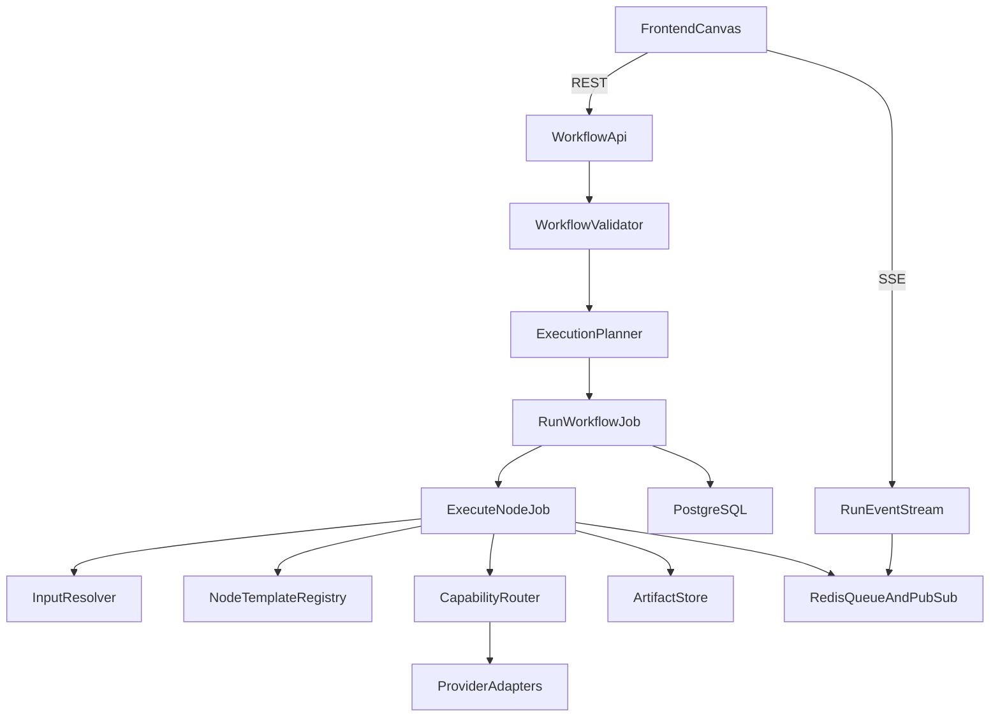

# AI Video Workflow Backend Implementation Plan

> **For Claude:** REQUIRED SUB-SKILL: Use superpowers:executing-plans to implement this plan task-by-task.

**Goal:** Build a fresh Laravel backend in this workspace that becomes the runtime and system of record for the existing AI Video Workflow Builder frontend, without requiring the frontend repo to be present during the initial backend build.

**Architecture:** The backend owns workflow CRUD, run planning, queue-based node execution, provider abstraction, artifact storage, caching, review checkpoints, and live progress streaming. It mirrors the frontend node methodology in PHP so that node templates on both sides describe the same ports, config schema, and execution contract, even though the frontend stays mock-driven initially and the backend performs real provider calls.

**Tech Stack:** Laravel, PostgreSQL, Redis, queue workers, Docker Compose, SSE-first event streaming, local artifact storage behind an adapter, capability-based provider integrations.

---

## Purpose And Constraints

This backend is not a passive persistence layer. It is the workflow runtime. Its primary job is to accept a workflow document shaped like the frontend model, validate that document against known node templates, derive a legal execution plan, execute the nodes in dependency order, persist every meaningful transition, and stream enough state back to the frontend that the canvas can update in real time.

The most important design constraint is contract consistency with the existing frontend. The backend does not need to copy frontend TypeScript code, but it must preserve the same design methodology:
- node templates declare typed input and output ports
- node templates define config defaults and runtime validation rules
- execution consumes `PortPayload`-like data and produces the same conceptual payloads
- workflow validation and compatibility semantics remain stable across frontend and backend

The second important constraint is staged delivery. Milestone 1 should produce a complete runtime architecture and fully real execution for a carefully chosen subset of node types rather than forcing all 11 nodes to become production-ready at once. That makes the foundation reliable without blocking on every provider integration detail.

## Working Assumptions

- The frontend remains in a different repo or path during this phase.
- This workspace will become a new Laravel application.
- No authentication or multi-tenancy is required yet.
- Artifact storage should start on the local filesystem but must be hidden behind an interface so S3 or R2 can be added later.
- SSE is the preferred first transport for live progress because the current requirement is server-to-client streaming rather than full bidirectional collaboration.
- PostgreSQL JSONB should be used where the workflow document and run payloads naturally remain document-shaped, but core lookup fields should still be relational and indexed.

## Proposed Project Layout

The backend should be organized around domain boundaries rather than a flat controller/service structure:

- Infrastructure and application bootstrap in `[docker-compose.yml](docker-compose.yml)`, `[Dockerfile](Dockerfile)`, `[composer.json](composer.json)`, `[config/database.php](config/database.php)`, `[config/queue.php](config/queue.php)`, `[config/filesystems.php](config/filesystems.php)`, and `[config/services.php](config/services.php)`.
- Node system contracts and template registry in `[app/Domain/Nodes](app/Domain/Nodes)`.
- Execution planner, validator, cache, and orchestration logic in `[app/Domain/Execution](app/Domain/Execution)`.
- Provider abstractions and concrete adapters in `[app/Domain/Providers](app/Domain/Providers)` and `[app/Infrastructure/Providers](app/Infrastructure/Providers)`.
- Persistence models and repositories in `[app/Models](app/Models)` and `[app/Domain/Persistence](app/Domain/Persistence)`.
- API controllers, requests, resources, and streaming endpoints in `[app/Http](app/Http)` and `[routes/api.php](routes/api.php)`.
- External contract docs and implementation notes in `[docs/api](docs/api)` and `[docs/architecture](docs/architecture)`.

This keeps the execution engine testable as plain domain code, with Laravel primarily providing HTTP, queues, events, storage, and configuration.

## Runtime Overview

The request flow should work like this:
1. The frontend creates or updates a workflow document through CRUD endpoints.
2. The frontend triggers a run using a workflow id plus trigger metadata.
3. The API validates the workflow and creates an `ExecutionRun` row.
4. A planner service derives the scoped node set and topological order.
5. A run job dispatches node execution jobs, either sequentially or in dependency-aware batches.
6. Each node resolves its inputs, consults cache, executes or skips, persists state, and emits events.
7. The frontend subscribes to the run event stream and updates node badges, previews, and edge state live.

## Canonical Backend Contracts

The first major implementation decision is how to express frontend concepts cleanly in PHP. The backend should define immutable DTOs or readonly value objects for the core runtime contract:

- `DataType`
- `PortDefinition`
- `PortPayload`
- `WorkflowNodeData`
- `WorkflowEdgeData`
- `WorkflowDocumentData`
- `ExecutionPlanData`
- `ValidationIssueData`
- `CompatibilityResultData`

Recommended files:
- `[app/Domain/Nodes/Data/DataType.php](app/Domain/Nodes/Data/DataType.php)`
- `[app/Domain/Nodes/Data/PortDefinition.php](app/Domain/Nodes/Data/PortDefinition.php)`
- `[app/Domain/Nodes/Data/PortPayload.php](app/Domain/Nodes/Data/PortPayload.php)`
- `[app/Domain/Execution/Data/ExecutionPlanData.php](app/Domain/Execution/Data/ExecutionPlanData.php)`
- `[app/Domain/Execution/Data/ValidationIssueData.php](app/Domain/Execution/Data/ValidationIssueData.php)`

Use PHP enums for bounded domains such as data types, run status, node run status, trigger type, and compatibility severity. Use readonly classes for composite records. The important point is not whether the representation is enum-backed or string-backed internally; it is that the public domain model remains explicit, typed, and serializable.

## Node Template System

The node template contract is the backbone of the backend. Every template should declare:
- type
- template version
- title
- category
- description
- inputs
- outputs
- default config
- config validator
- preview builder
- execution handler or a non-executable marker

Recommended files:
- `[app/Domain/Nodes/Contracts/NodeTemplate.php](app/Domain/Nodes/Contracts/NodeTemplate.php)`
- `[app/Domain/Nodes/Contracts/ExecutableNodeTemplate.php](app/Domain/Nodes/Contracts/ExecutableNodeTemplate.php)`
- `[app/Domain/Nodes/Contracts/NodeExecutionContext.php](app/Domain/Nodes/Contracts/NodeExecutionContext.php)`
- `[app/Domain/Nodes/Registry/NodeTemplateRegistry.php](app/Domain/Nodes/Registry/NodeTemplateRegistry.php)`

The backend should also model config validation explicitly. In Laravel, a practical approach is to expose each template’s config rules as a dedicated validator object or array rule provider rather than trying to emulate Zod directly. The goal is shape parity, not library parity.

Dynamic-port templates such as `imageGenerator` should declare all possible ports statically but offer an `activePorts(config)` or `resolvePortActivity(config)` mechanism so validation and execution can tell which ports are active for a given config instance.

All 11 node templates should exist in milestone 1. However, only a staged subset must be fully provider-backed. The rest can still be contract-complete and preview-capable.

## Persistence Model

The backend replaces the frontend’s Dexie persistence with PostgreSQL-backed storage. The persistence model should balance document flexibility with queryability.

Recommended tables:
- `workflows`
- `workflow_snapshots` if crash recovery or autosave snapshots are kept server-side
- `execution_runs`
- `node_run_records`
- `edge_payload_snapshots`
- `run_cache_entries`
- `artifacts`

Recommended model files:
- `[app/Models/Workflow.php](app/Models/Workflow.php)`
- `[app/Models/ExecutionRun.php](app/Models/ExecutionRun.php)`
- `[app/Models/NodeRunRecord.php](app/Models/NodeRunRecord.php)`
- `[app/Models/RunCacheEntry.php](app/Models/RunCacheEntry.php)`
- `[app/Models/Artifact.php](app/Models/Artifact.php)`

Recommended storage rules:
- Keep the full workflow document in JSONB on `workflows.document`.
- Index `workflows.name`, `workflows.updated_at`, and perhaps `workflows.tags` if filtering is expected.
- Persist `execution_runs.document_hash` and `execution_runs.node_config_hashes` as first-class data for replay and cache diagnostics.
- Keep `node_run_records.input_payloads` and `node_run_records.output_payloads` in JSONB.
- Keep artifact metadata relational and store the actual file outside the database.

Do not store large binary outputs inline in payload JSON. Payloads should hold preview URLs, artifact ids, or metadata summaries, not the media body itself.

## Validation And Compatibility

The validator should run before execution planning and again on any API that saves or executes a workflow. It should cover:
- cycle detection
- missing required ports
- incompatible source/target data types
- inactive-port misuse for config-dependent templates
- unknown node types
- invalid config shapes
- orphaned or unreachable nodes if those should surface as warnings

Recommended files:
- `[app/Domain/Execution/WorkflowValidator.php](app/Domain/Execution/WorkflowValidator.php)`
- `[app/Domain/Execution/Compatibility/PortCompatibilityService.php](app/Domain/Execution/Compatibility/PortCompatibilityService.php)`

Compatibility rules should mirror the frontend:
- exact type match is compatible
- scalar-to-list wrapping is allowed with warning
- list-to-scalar is not allowed
- semantically different asset types are not allowed without an adapter node

The output of validation should be a structured list of `ValidationIssueData` records so the API can return machine-readable issues, not only generic strings.

## Execution Planning

Planning logic belongs in pure domain services, not inside jobs. The planner should accept a workflow document plus trigger metadata and return:
- the scope node ids
- the ordered node ids
- skipped node ids known at planning time, such as disabled nodes

Recommended files:
- `[app/Domain/Execution/ExecutionPlanner.php](app/Domain/Execution/ExecutionPlanner.php)`
- `[app/Domain/Execution/Graph/IncomingEdgeIndex.php](app/Domain/Execution/Graph/IncomingEdgeIndex.php)`
- `[app/Domain/Execution/Graph/OutgoingEdgeIndex.php](app/Domain/Execution/Graph/OutgoingEdgeIndex.php)`

The planner must support:
- `runWorkflow`
- `runNode`
- `runFromHere`
- `runUpToHere`

The planner should use graph indexes to collect upstream and downstream node sets and then apply Kahn’s algorithm to the scoped subgraph. This logic should be heavily unit tested because it is deterministic and easy to regress.

## Execution Loop

The execution loop should stay faithful to the frontend semantics while adapting to Laravel queues:

1. Load the run and plan.
2. For each node in order, check cancellation.
3. Skip disabled nodes or already-blocked nodes.
4. Resolve inputs in this order:
   - successful upstream output from the current run
   - reusable cache hit
   - preview output from a non-executable node
5. If required inputs are missing, mark skipped with reason.
6. If node is non-executable, build preview output and mark success.
7. If executable, compute cache key and try cache reuse.
8. On cache miss, execute via capability/provider services.
9. Persist outputs, artifact references, duration, and terminal status.
10. Emit progress events after every meaningful transition.

Recommended files:
- `[app/Jobs/RunWorkflowJob.php](app/Jobs/RunWorkflowJob.php)`
- `[app/Jobs/ExecuteNodeJob.php](app/Jobs/ExecuteNodeJob.php)`
- `[app/Domain/Execution/InputResolver.php](app/Domain/Execution/InputResolver.php)`
- `[app/Domain/Execution/NodeExecutor.php](app/Domain/Execution/NodeExecutor.php)`

For milestone 1, it is acceptable for orchestration to be logically sequential even if the jobs are queued. Parallel node execution can be introduced later once dependency barriers and event ordering are well-defined.

## Cache Design

Caching should be implemented as part of the runtime, not as an afterthought. The cache key should combine:
- node type
- template version
- schema version
- config hash
- normalized input hash

Recommended files:
- `[app/Domain/Execution/Cache/RunCache.php](app/Domain/Execution/Cache/RunCache.php)`
- `[app/Domain/Execution/Hashing/PayloadHasher.php](app/Domain/Execution/Hashing/PayloadHasher.php)`

Normalization rules should strip volatile fields like timestamps and source metadata so logically identical inputs hash the same way. Cache entries should reference persisted output payloads and artifact references, not ephemeral process memory.

## Review Checkpoints And Cancellation

The runtime should support human-in-the-loop review via `reviewCheckpoint` nodes. When such a node executes:
- node status becomes `awaitingReview`
- run status becomes `awaitingReview`
- a review event is emitted
- execution pauses until the user approves or rejects

Recommended files:
- `[app/Domain/Execution/Review/ReviewCheckpointService.php](app/Domain/Execution/Review/ReviewDecision.php)`
- `[app/Http/Controllers/ReviewDecisionController.php](app/Http/Controllers/ReviewDecisionController.php)`

Cancellation should be modeled at run level and observed between nodes and inside provider adapters where possible. Since PHP queue jobs do not naturally share an `AbortSignal`, use persisted run state plus cooperative checks in execution services.

## Provider Abstraction

Provider abstraction should be capability-based, not vendor-based. Nodes should ask for capabilities such as:
- text generation
- text-to-image
- text-to-speech
- structured transformation
- media composition

Recommended files:
- `[app/Domain/Providers/Contracts/CapabilityProvider.php](app/Domain/Providers/Contracts/CapabilityProvider.php)`
- `[app/Domain/Providers/CapabilityRouter.php](app/Domain/Providers/CapabilityRouter.php)`
- `[app/Infrastructure/Providers](app/Infrastructure/Providers)`

Each provider adapter should translate raw vendor responses into backend-native payloads and artifact objects. This makes nodes stable even if providers change.

## Staged Live Node Scope

Milestone 1 should make these nodes real first:
- `scriptWriter`
- `sceneSplitter`
- `promptRefiner`
- `imageGenerator`

These form a coherent vertical slice from prompt to generated images. They prove:
- graph planning
- sequential execution
- provider abstraction
- payload propagation
- artifact storage
- live frontend updates

The following can be contract-complete but staged for later real execution:
- `imageAssetMapper`
- `ttsVoiceoverPlanner`
- `subtitleFormatter`
- `videoComposer`
- `reviewCheckpoint`
- `finalExport`

If `reviewCheckpoint` is strategically important for the frontend interaction model, it should still be implemented in milestone 1 even if some media nodes remain stubbed.

## Artifact Storage

Artifact storage must be abstract from the start. The node executor should never write directly to local disk paths. Instead, define an artifact storage interface with methods such as:
- store generated content
- store remote-download content
- create public or signed retrieval URLs
- resolve artifact metadata by id

Recommended files:
- `[app/Domain/Artifacts/ArtifactStorage.php](app/Domain/Artifacts/ArtifactStorage.php)`
- `[app/Infrastructure/Storage/LocalArtifactStorage.php](app/Infrastructure/Storage/LocalArtifactStorage.php)`

Store artifact metadata like mime type, original filename, byte size, checksum, logical role, and owning run id. This avoids future migration pain when moving to S3 or R2.

## API Surface

The API should be designed for eventual frontend replacement of Dexie and the mock executor. Minimum endpoints:
- `GET /api/workflows`
- `POST /api/workflows`
- `GET /api/workflows/{workflow}`
- `PUT /api/workflows/{workflow}`
- `DELETE /api/workflows/{workflow}`
- `POST /api/workflows/{workflow}/runs`
- `GET /api/runs/{run}`
- `GET /api/runs/{run}/events`
- `POST /api/runs/{run}/cancel`
- `POST /api/runs/{run}/review-decisions`
- `GET /api/runs/{run}/artifacts/{artifact}`

Recommended controller files:
- `[app/Http/Controllers/WorkflowController.php](app/Http/Controllers/WorkflowController.php)`
- `[app/Http/Controllers/RunController.php](app/Http/Controllers/RunController.php)`
- `[app/Http/Controllers/RunEventStreamController.php](app/Http/Controllers/RunEventStreamController.php)`

The API should return structured resources with versionable response envelopes so the frontend integration phase does not depend on raw Eloquent serialization.

## Real-Time Streaming

SSE is the simplest first implementation because the runtime primarily needs to push updates outward. A single event stream endpoint per run can emit:
- run started
- node pending
- node running
- node success
- node skipped
- node error
- node awaiting review
- run terminal status

Recommended files:
- `[app/Events/RunStatusUpdated.php](app/Events/RunStatusUpdated.php)`
- `[app/Domain/Streaming/RunEventPublisher.php](app/Domain/Streaming/RunEventPublisher.php)`
- `[app/Http/Controllers/RunEventStreamController.php](app/Http/Controllers/RunEventStreamController.php)`

Use Redis pub/sub or queue-backed broadcast events so workers and HTTP stream endpoints can communicate without direct coupling.

## Suggested Delivery Phases

### Phase 1: Bootstrap And Persistence
- Create the Laravel app.
- Add Docker Compose for app, worker, postgres, and redis.
- Add migrations and Eloquent models for workflows, runs, node records, cache, and artifacts.
- Add a health endpoint and basic CRUD skeleton.

### Phase 2: Node Contract And Validation
- Implement enums, DTOs, node template contracts, registry, and all 11 template definitions.
- Implement config validation and port compatibility services.
- Expose template metadata endpoints if helpful for future frontend syncing.

### Phase 3: Planner And Core Execution
- Implement execution planner, input resolver, run creation, node lifecycle persistence, and sequential queued execution.
- Add cache-key generation and basic cache reuse.
- Add cancellation and terminal state derivation.

### Phase 4: Streaming And Review
- Add SSE event streaming.
- Emit events on every node and run state transition.
- Add review checkpoint persistence and resume behavior.

### Phase 5: Provider-Backed Vertical Slice
- Implement capability router and first real provider adapters.
- Make `scriptWriter`, `sceneSplitter`, `promptRefiner`, and `imageGenerator` run live.
- Persist resulting image artifacts and previews.

### Phase 6: Contract Docs And Frontend Handoff
- Write API and event-stream docs.
- Add sample workflow fixtures and seed data.
- Document exact payload contracts for frontend integration.

## Testing Strategy

The backend should be built with focused tests around deterministic logic and a smaller number of full-stack integration tests.

Recommended test areas:
- unit tests for planner scope rules and topological sorting
- unit tests for compatibility rules
- unit tests for config-dependent port activation
- unit tests for cache-key normalization
- feature tests for workflow CRUD
- feature tests for run trigger and run detail endpoints
- integration tests for SSE event ordering
- integration tests for one end-to-end provider-backed workflow in Docker

Recommended test folders:
- `[tests/Unit/Execution](tests/Unit/Execution)`
- `[tests/Unit/Nodes](tests/Unit/Nodes)`
- `[tests/Feature/Api](tests/Feature/Api)`
- `[tests/Feature/Runtime](tests/Feature/Runtime)`

Because provider APIs are external, provider client tests should mostly use fakes or recorded fixtures. Reserve only a limited opt-in smoke test path for real API calls.

## Risks To Manage Early

- Contract drift between frontend and backend port keys, statuses, or config shapes.
- Queue and stream timing causing the frontend to see stale node state.
- Overusing JSONB and losing important indexes on run history queries.
- Storing too much payload detail inline and making run records heavy.
- Provider output normalization being inconsistent for structured results such as `sceneList`.
- Introducing parallel execution too early and making debugging much harder.

## Definition Of Done For Milestone 1

Milestone 1 is done when:
- workflows can be created, updated, listed, and deleted via API
- a workflow run can be triggered for at least `runWorkflow` and `runNode`
- planner output is deterministic and validated by automated tests
- node status transitions persist correctly
- SSE emits live updates consumable by the frontend
- artifacts are stored and retrievable
- cache reuse works for at least one executable node
- at least one vertical slice from prompt to generated images executes with real provider calls
- API and event contracts are documented clearly enough for a frontend engineer to replace Dexie and the mock executor later

## Implementation Tasks

### Task 1: Bootstrap the backend platform

**Files:**
- Create `[composer.json](composer.json)` via Laravel bootstrap.
- Create `[docker-compose.yml](docker-compose.yml)` and `[Dockerfile](Dockerfile)`.
- Create `[config/services.php](config/services.php)` provider settings.
- Create `[README.md](README.md)` local setup instructions.

**Step 1:** Scaffold a fresh Laravel app with PostgreSQL and Redis support.

**Step 2:** Add Docker Compose services for `app`, `worker`, `postgres`, and `redis`.

**Step 3:** Configure `.env.example` for DB, Redis, storage, and provider secrets.

**Step 4:** Add a minimal health check route and verify app boot.

### Task 2: Define the node contract layer

**Files:**
- Create `[app/Domain/Nodes/Data](app/Domain/Nodes/Data)`.
- Create `[app/Domain/Nodes/Contracts](app/Domain/Nodes/Contracts)`.
- Create `[app/Domain/Nodes/Registry/NodeTemplateRegistry.php](app/Domain/Nodes/Registry/NodeTemplateRegistry.php)`.
- Create `[app/Domain/Nodes/Templates](app/Domain/Nodes/Templates)`.

**Step 1:** Add enums and readonly DTOs for data types, ports, payloads, statuses, and workflow graph records.

**Step 2:** Define template interfaces for executable and non-executable nodes.

**Step 3:** Implement all 11 templates with config defaults and validation rules.

**Step 4:** Register templates centrally and expose metadata access.

### Task 3: Build workflow and run persistence

**Files:**
- Create migrations in `[database/migrations](database/migrations)`.
- Create models in `[app/Models](app/Models)`.
- Create repositories or persistence services in `[app/Domain/Persistence](app/Domain/Persistence)`.

**Step 1:** Add schema for workflows, execution runs, node run records, cache entries, and artifacts.

**Step 2:** Implement model casting for JSONB document fields.

**Step 3:** Add persistence helpers for run creation, run updates, and node record mutation.

### Task 4: Build validation, planning, and execution core

**Files:**
- Create `[app/Domain/Execution/WorkflowValidator.php](app/Domain/Execution/WorkflowValidator.php)`.
- Create `[app/Domain/Execution/ExecutionPlanner.php](app/Domain/Execution/ExecutionPlanner.php)`.
- Create `[app/Domain/Execution/InputResolver.php](app/Domain/Execution/InputResolver.php)`.
- Create `[app/Domain/Execution/NodeExecutor.php](app/Domain/Execution/NodeExecutor.php)`.
- Create `[app/Jobs/RunWorkflowJob.php](app/Jobs/RunWorkflowJob.php)`.
- Create `[app/Jobs/ExecuteNodeJob.php](app/Jobs/ExecuteNodeJob.php)`.

**Step 1:** Implement validation and compatibility checks.

**Step 2:** Implement scope extraction and topological sort.

**Step 3:** Implement input resolution, skip logic, and non-executable preview handling.

**Step 4:** Persist all run and node state transitions.

### Task 5: Add cache, cancellation, review, and streaming

**Files:**
- Create `[app/Domain/Execution/Cache](app/Domain/Execution/Cache)`.
- Create `[app/Domain/Execution/Review](app/Domain/Execution/Review)`.
- Create `[app/Domain/Streaming](app/Domain/Streaming)`.
- Create `[app/Http/Controllers/RunEventStreamController.php](app/Http/Controllers/RunEventStreamController.php)`.

**Step 1:** Implement normalized hashing and cache lookup/write.

**Step 2:** Add cooperative cancellation checks and terminal run status derivation.

**Step 3:** Add review checkpoint pause and resume flows.

**Step 4:** Add SSE event publishing and stream consumption.

### Task 6: Add provider abstraction and staged live nodes

**Files:**
- Create `[app/Domain/Providers/Contracts](app/Domain/Providers/Contracts)`.
- Create `[app/Domain/Providers/CapabilityRouter.php](app/Domain/Providers/CapabilityRouter.php)`.
- Create `[app/Infrastructure/Providers](app/Infrastructure/Providers)`.

**Step 1:** Define capability contracts.

**Step 2:** Implement initial provider adapters.

**Step 3:** Wire live execution for `scriptWriter`, `sceneSplitter`, `promptRefiner`, and `imageGenerator`.

**Step 4:** Persist artifacts and payload previews from real provider outputs.

### Task 7: Expose the application API

**Files:**
- Modify `[routes/api.php](routes/api.php)`.
- Create `[app/Http/Controllers/WorkflowController.php](app/Http/Controllers/WorkflowController.php)`.
- Create `[app/Http/Controllers/RunController.php](app/Http/Controllers/RunController.php)`.
- Create `[app/Http/Controllers/ReviewDecisionController.php](app/Http/Controllers/ReviewDecisionController.php)`.

**Step 1:** Add workflow CRUD endpoints.

**Step 2:** Add run trigger, run status, cancel, review, and artifact endpoints.

**Step 3:** Add request validation and resource serialization.

### Task 8: Verify, document, and prepare frontend integration

**Files:**
- Create `[tests/Unit](tests/Unit)` and `[tests/Feature](tests/Feature)` coverage.
- Create `[docs/api/workflow-runtime.md](docs/api/workflow-runtime.md)`.
- Create `[docs/api/event-stream.md](docs/api/event-stream.md)`.
- Create `[docs/architecture/runtime.md](docs/architecture/runtime.md)`.

**Step 1:** Add unit and feature tests around planning, validation, cache, and API behavior.

**Step 2:** Document REST and SSE contracts with examples.

**Step 3:** Add one seed workflow fixture that demonstrates the milestone-1 live path.

## Handoff Notes

When implementation begins, the engineer should preserve a strong separation between domain contracts and framework concerns. The fastest way to lose control of this project is to let execution logic leak into controllers, jobs, or Eloquent models. Keep the runtime deterministic, DTO-driven, and tested independently from transport and persistence details.
