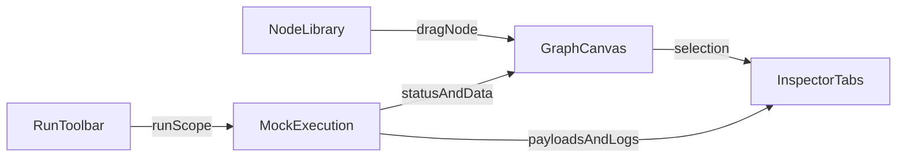

# AI Video Workflow Builder Visual Design System

> **Scope:** Visual language and interaction patterns for a three-panel workflow builder with node cards, typed edges, data inspector, and mock execution.
>
> **Stack target:** React, React Flow (`@xyflow/react`), Tailwind CSS, shadcn/ui.
>
> **Default mode:** Dark.

## 1. Design Intent

This product should feel like a professional instrument panel for building and debugging AI video pipelines. The visual language needs to be legible at high density, calm under heavy state changes, and explicit about data flow, type compatibility, and execution status.

The best blend for this space is:

- Figma Dev Mode for panel hierarchy, inspection density, and token discipline.
- n8n and ComfyUI for graph editing affordances, typed connections, and workflow mental models.
- React Flow examples for implementation realism and interaction constraints.

### UX Principles

1. **Signal over decoration**
   Every accent color must mean something: selection, live execution, validation, or data type.

2. **Graph state should be glanceable**
   A user should understand what is selected, what is runnable, what is invalid, and what just executed in under two seconds.

3. **Developer-first density**
   The interface should prefer compact metadata, monospace readouts, explicit IDs, and keyboard affordances over oversized cards and empty chrome.

4. **One selection model**
   Left panel populates the canvas, center canvas owns primary selection, right inspector reflects that selection immediately.

5. **Typed connections must feel trustworthy**
   Ports, edges, badges, and previews should make type compatibility obvious before a user commits a connection.

6. **Mock execution should be readable, not theatrical**
   Execution feedback should be animated enough to follow traversal, but not so animated that it becomes distracting during iterative debugging.

## 2. Product Frame And Constraints

### Layout

- **Left panel:** searchable, categorized, draggable node library.
- **Center panel:** React Flow canvas with custom node cards and typed edges.
- **Right panel:** inspector with tabs for `Config`, `Preview`, `Data`, `Validation`, and `Metadata`.
- **Top of center panel:** run toolbar with `Run Workflow`, `Run Node`, `Run From Here`, and `Cancel`.

### Technical Constraints

- Use shadcn/ui semantics and primitives wherever possible.
- Map all colors through CSS variables so React Flow nodes, SVG edges, and shadcn components share one token system.
- Keep surfaces and states expressible through Tailwind utilities plus a small set of custom variables.
- Assume long sessions, large graphs, and data-heavy inspector content.

### Information Architecture

## 3. Divergent Directions

The three directions below are deliberately different, not cosmetic variations. All three are feasible in React Flow with custom nodes, custom edges, and shadcn/Tailwind styling.

---

## 4. Direction A: IndustrialTerminal

**Positioning:** Dense, utilitarian, restrained, highly inspectable. This is the most operations-oriented direction.

### Color System + Typography

**Palette**

- Canvas base: `#0A0A0B`
- Panel chrome: `#111216`
- Surface raised: `#16181D`
- Border / divider: `#262A33`
- Text primary: `#F3F4F6`
- Text secondary: `#9AA0AE`
- Text tertiary: `#6B7280`
- Signal / execution: `#F59E0B`
- Link / type / structure: `#22D3EE`
- Success: `#10B981`
- Warning: `#F59E0B`
- Error: `#F43F5E`

**Tone rules**

- Amber means execution, attention, and active run state.
- Cyan means structure, data linkage, and type signaling.
- Large gradients are avoided entirely.

**Typography**

- UI chrome: neutral sans, `text-xs` to `text-sm`, medium weight.
- Section labels: uppercase, `tracking-wide`, `text-[10px]`.
- IDs, ports, payload types, timestamps, JSON: monospace.
- Numeric telemetry: monospace with tabular numerals.

### Node Card Design

**Card anatomy**

- Flat rectangular frame with `rounded-sm` or `rounded-md`.
- Header strip for icon, node family, compact status glyph.
- Main body for node name and a second line of machine-readable metadata.
- Left and right port rails with compact labels.
- Footer row for duration, frame count, or warning code.

**State system**

- Default: neutral border, dark surface.
- Hover: slightly brighter border and text.
- Focus-visible: thin amber ring with no scale.
- Selected: amber border plus 3px top rule.
- Dragging: slight shadow, elevated z-index, 95% opacity.
- Disabled: low-opacity, muted text, ports hollowed out.
- Queued: amber badge in header.
- Running: animated amber dash on border and pulsing state dot.
- Success: small emerald glyph and resolved border.
- Warning: amber code badge, no full-card tint.
- Error: rose border and short error code in footer.
- Stale-data: dashed border plus `STALE` badge.
- Mock-preview-available: cyan micro badge near footer metadata.

### Edge Design

**Base behavior**

- Prefer `SmoothStep` or orthogonal-feeling edges over playful bezier curves.
- Default stroke is low-contrast and mostly neutral.

**Type treatment**

- The line itself stays mostly neutral.
- A compact inline badge carries the type: `VIDEO`, `AUDIO`, `MASK`, `JSON`, `FRAMESET`.
- Badge border uses semantic type color while the edge line remains quiet.

**States**

- Default: `1.5px` neutral stroke.
- Hovered: brighter neutral stroke, wider interaction width.
- Selected: amber stroke at `2px`.
- Valid connection preview: cyan stroke with subtle dash animation.
- Invalid connection preview: rose dotted stroke plus inline reason.
- Active execution path: amber animated dash.
- Success path: emerald flash that fades back to neutral.
- Errored path: rose line with midpoint error marker.
- Disabled / blocked: dashed, low-opacity.

### Inspector Layout Per Tab

**Overall shell**

- Fixed-width right panel around `380px`.
- Border-left separation, no card stack aesthetic.
- Dense sections separated by 1px lines.

**Config**

- Tight form rows, grouped by all-caps section labels.
- Small inputs and selects.
- Destructive operations placed in a dedicated lower zone.

**Preview**

- 16:9 viewport with black letterbox interior.
- Bottom metadata strip for resolution, FPS, duration, codec.
- Minimal scrubber with amber playhead.

**Data**

- Input and output toggle.
- Monospace JSON tree.
- Sticky copy/filter actions.

**Validation**

- Severity-coded list with terse messages and machine-like validation codes.
- Empty state says `NO BLOCKING ISSUES`.

**Metadata**

- Two-column key-value table.
- Read-only feel, with copyable IDs and provenance.

### Run Toolbar States

- Idle: `Run Workflow` is clearly primary.
- Ready: selected-node actions become available.
- Running workflow: pulsing amber dot, elapsed time, other run buttons disabled.
- Running single node: toolbar chip indicates scope.
- Running from here: scope chip and breadcrumb-like source label.
- Cancelling: `Cancel` shows spinner and status text `Stopping...`.
- Success: brief green check state, then returns to idle.
- Warning: thin amber strip below toolbar with summary.
- Failed: rose left rule and retry affordance.

### Empty State Designs

- Canvas empty: dashed equipment-bay rectangle and uppercase `NO NODES IN GRAPH`.
- Inspector empty: neutral scaffold lines and `NO SELECTION`.
- Library empty: compact `NO MATCHES` search result state.
- Preview empty: framed placeholder with `PREVIEW UNAVAILABLE`.
- Validation clear: one-line muted success state.
- No execution history: thin panel row explaining mock run availability.

### Reference Screenshots / Inspirations

1. [Figma Dev Mode](https://www.figma.com/dev-mode)
   Borrow the inspection density, panel hierarchy, and structured property grouping.

2. [React Flow Dark Mode Example](https://reactflow.dev/examples/styling/dark-mode)
   Borrow the dark-canvas baseline and realistic expectations for custom node and edge contrast.

3. [ComfyUI Interface Overview](https://docs.comfy.org/interface/overview)
   Borrow the left-sidebar plus graph plus right-properties structure and drag-to-canvas mental model.

---

## 5. Direction B: CinematicSignal

**Positioning:** Higher contrast, tuned for AI video workflows, more expressive around preview and execution tracing.

### Color System + Typography

**Palette**

- Base shell: `#07080C`
- Elevated panel: `#0D0F16`
- Nested field: `#12151E`
- Border default: `#1E2433`
- Border strong: `#2E3A52`
- Text primary: `#E8ECF5`
- Text secondary: `#8B95AD`
- Text tertiary: `#5C657A`
- Signal cyan: `#22D3EE`
- Video amber: `#FBBF24`
- Data violet: `#A78BFA`
- Success: `#34D399`
- Error: `#FB7185`

**Tone rules**

- Cyan is reserved for active execution and edge tracing.
- Amber marks media-bearing nodes and preview-oriented elements.
- Violet is only for data-centric inspector accents and non-media payload cues.

**Typography**

- Sans: IBM Plex Sans or similar tooling-oriented grotesk.
- Mono: IBM Plex Mono or JetBrains Mono.
- Node titles and toolbar CTAs are slightly larger than Direction A.
- Metadata still stays compact and code-like.

### Node Card Design

**Card anatomy**

- Rounded card with a stronger silhouette than IndustrialTerminal.
- Top identity row with icon, title, menu affordance, and state badge.
- Secondary role strip with node family, model name, resolution, or FPS chips.
- Optional thumbnail strip for video-heavy nodes.
- Port labels set in tiny monospace near handles.

**State system**

- Default: raised surface with modest border and soft inner gradient.
- Hover: stronger border and slightly deeper shadow.
- Focus-visible: cyan ring.
- Selected: cyan ring plus cleaner edge glow.
- Dragging: slight scale on inner card only.
- Disabled: grayscale + reduced opacity.
- Queued: badge and muted pulse.
- Running: animated shimmer through title bar plus active spine.
- Success: quiet green badge and settled border.
- Warning: amber chip and optional help cue.
- Error: rose-tinted header strip and inline error copy.
- Stale-data: subtle outline plus `Out of date` caption.
- Mock-preview-available: thumbnail slot or preview pill activated.

### Edge Design

**Base behavior**

- Smooth bezier or smoothstep edges with slightly more visual presence.
- Edge tracing is part of the signature of this direction.

**Type treatment**

- Type can live in both handle color and edge label.
- Media edges can use a warmer label treatment than control/data edges.

**States**

- Default: muted slate stroke.
- Hovered: brighter stroke and label reveal.
- Selected: cyan stroke with soft outer glow.
- Valid connection preview: cyan ghost edge.
- Invalid connection preview: rose edge with explanatory badge.
- Active execution path: animated cyan glow and moving dash or traveling dot.
- Success path: cyan-to-neutral settle.
- Errored path: rose arrowhead and failed-node emphasis.
- Disabled / blocked: lowered opacity and dashes.

### Inspector Layout Per Tab

**Overall shell**

- `380px` to `420px` width with sticky tab bar.
- More visual hierarchy than Direction A.
- Preview tab gets stronger visual emphasis because this is an AI video tool.

**Config**

- Uses accordion sections like `Model`, `Sampling`, `Resolution`, `Timing`, `I/O`.
- Supports richer control rows without feeling bloated.

**Preview**

- Preview viewport is the visual anchor of the inspector.
- Video metadata and playback controls sit directly underneath.

**Data**

- Input and output are split into sub-tabs or two compact panels.
- JSON remains monospace, but with slightly richer syntax emphasis.

**Validation**

- Validation groups into schema, policy, and runtime constraints.
- Blocking issues are visually prominent without hijacking the whole panel.

**Metadata**

- Key-value grid with read-only provenance and run details.
- Copy actions stay lightweight and ghost-styled.

### Run Toolbar States

- Idle: prominent primary CTA with stronger emphasis than other directions.
- Ready: contextual node actions enable based on selection.
- Running workflow: toolbar chip reports step progression.
- Running single node: status says exactly which node is active.
- Running from here: source scope becomes part of the status label.
- Cancelling: cyan fades down while destructive cancel state remains visible.
- Success: short-lived completed state, then idle.
- Warning: partial-completion banner or warning chip.
- Failed: inline destructive status plus quick retry.

### Empty State Designs

- Canvas empty: larger dashed dropzone, stronger title, and clear first action.
- Inspector empty: schematic node illustration plus concise guidance.
- Library empty: icon plus reset filter CTA.
- Preview empty: refined 16:9 placeholder frame.
- Validation clear: subdued success banner.
- No execution history: invite first mock execution with concise copy.

### Reference Screenshots / Inspirations

1. [React Flow Custom Nodes](https://reactflow.dev/docs/guides/custom-nodes)
   Borrow the implementation realism around interactive node surfaces and handle customization.

2. [Figma Dev Mode](https://www.figma.com/dev-mode)
   Borrow the polished inspector organization and code-facing property display.

3. [ComfyUI Interface Exploration Tutorial](https://comfyui.org/en/interface-exploration-tutorial)
   Borrow the graph-editing mental model and the priority given to a central workflow canvas.

---

## 6. Direction C: PrecisionStudio

**Positioning:** Minimal, polished, systemized, disciplined. This is the cleanest and most shadcn-native option.

### Color System + Typography

**Palette**

- App background: deep neutral around `oklch(0.14 0.01 260)` or equivalent dark slate.
- Panel / card surface: one step lighter than background.
- Canvas: recessed field, optionally with low-opacity dot grid.
- Border: semantic `border` token throughout.
- Text primary: shadcn `foreground`.
- Text secondary: shadcn `muted-foreground`.
- Primary accent: one cool blue-cyan accent for selection and active state.
- Semantic warning and destructive colors only appear when required.

**Tone rules**

- Avoid multiple simultaneous accent families.
- Let borders, spacing, and typography do most of the work.
- Selection should be obvious through ring + shape, not color alone.

**Typography**

- Sans: Geist or equivalent neutral product sans.
- Mono: Geist Mono or JetBrains Mono.
- Base UI density: `text-xs` and `text-sm`.
- Only empty states and primary titles use larger type.

### Node Card Design

**Card anatomy**

- shadcn-card mental model translated into React Flow.
- Header row for icon, title, and status.
- Optional subtitle for type or provider.
- Handle row aligned to a strict grid.
- Body only exposes 1 to 3 key fields; full editing belongs in inspector.

**State system**

- Default: `bg-card`, `border-border`.
- Hover: faint ring or slightly stronger border.
- Focus-visible: clean primary ring.
- Selected: 2px primary ring and subtle accent on icon.
- Dragging: only moment where shadow rises.
- Disabled: low opacity and non-interactive body.
- Queued: subtle badge.
- Running: thin left accent bar and spinner.
- Success: small semantic badge only, not a green card.
- Warning: compact amber badge.
- Error: border-destructive plus readable inline badge.
- Stale-data: muted informational badge.
- Mock-preview-available: small preview indicator, not a layout change.

### Edge Design

**Base behavior**

- Default edge remains quiet and mostly neutral.
- Emphasis arrives only on hover, selection, or run tracing.

**Type treatment**

- Distinguish control vs data with line style before color.
- Use small marker and label treatments instead of loud edge colors.

**States**

- Default: muted stroke at `1.5px`.
- Hovered: brighter stroke and wider interaction area.
- Selected: primary stroke at `2px`.
- Valid connection preview: primary dotted preview.
- Invalid connection preview: destructive stroke.
- Active execution path: animated primary dash.
- Success path: brief semantic settle.
- Errored path: destructive marker or icon.
- Disabled / blocked: low-opacity dashed path.

### Inspector Layout Per Tab

**Overall shell**

- Sticky tabs and dense but orderly content blocks.
- Uses standard shadcn tabs, separators, alerts, badges, and scroll areas.

**Config**

- Form-first, sectioned, with helper text.
- Advanced fields collapse naturally.

**Preview**

- Simple aspect-ratio frame and minimal transport controls.
- No dramatic visual framing.

**Data**

- Tree or code block presentation in a muted panel.
- Copy and download actions sit above the content.

**Validation**

- Summary badge row, then issue list.
- Clean empty state with a single positive line.

**Metadata**

- Read-only grid of timestamps, node IDs, versions, and provenance.

### Run Toolbar States

- Idle: one primary button, two secondary context actions.
- Ready: contextual actions enable when selection exists.
- Running workflow: spinner and scope badge.
- Running single node: exact scope called out.
- Running from here: persistent scope chip.
- Cancelling: destructive button enters pending state.
- Success: subtle completed state.
- Warning: non-blocking warning chip.
- Failed: inline destructive status with retry path.

### Empty State Designs

- Canvas empty: dashed quiet region, one headline, one supporting line.
- Inspector empty: compact guidance rather than illustration-heavy empty states.
- Library empty: search icon and clear-filters action.
- Preview empty: simple muted aspect ratio shell.
- Validation clear: one-line success.
- No execution history: concise muted explanation.

### Reference Screenshots / Inspirations

1. [VS Code](https://code.visualstudio.com/)
   Borrow the strict panel separation, quiet dark theme, and developer-first density.

2. [Linear](https://linear.app/)
   Borrow the refinement of spacing, subtle focus states, and keyboard-native feel.

3. [React Flow Dark Mode Example](https://reactflow.dev/examples/styling/dark-mode)
   Borrow the practical baseline for dark-canvas theming and contrast management.

---

## 7. Recommended Synthesis

**Recommendation:** Use **PrecisionStudio** as the structural base, blend in **IndustrialTerminal**'s type clarity and state discipline, and selectively borrow **CinematicSignal**'s execution tracing and preview emphasis.

This hybrid is the best fit for an AI video workflow builder because:

- It stays calm and professional during long technical sessions.
- It avoids the visual noise that large graph editors can accumulate.
- It still gives execution and preview enough emphasis to support video-centric workflows.
- It maps cleanly onto shadcn tokens and React Flow customization surfaces.

### Final Design Character

- Base mood: restrained, instrument-grade, dark neutral.
- Accent behavior: one primary cyan-blue for focus and selected graph state; amber reserved for execution and media cues.
- Semantic colors: success, warning, destructive only when they communicate status.
- Density: compact, with monospace metadata and minimal ornamental chrome.

## 8. Final Token System

### Core Tokens

| Token | Purpose | Suggested Value |
|---|---|---|
| `--background` | App shell | `#0B0D12` |
| `--card` | Panels and node surfaces | `#11141B` |
| `--muted` | Nested wells and fields | `#151A22` |
| `--border` | Dividers and card borders | `#252B36` |
| `--foreground` | Primary text | `#E6EAF2` |
| `--muted-foreground` | Secondary text | `#8A93A5` |
| `--primary` | Selection, active tabs, focused states | `#38BDF8` |
| `--signal` | Execution / live traversal | `#F59E0B` |
| `--success` | Passed / completed | `#22C55E` |
| `--warning` | Degraded / caution | `#F59E0B` |
| `--destructive` | Error / invalid | `#F43F5E` |
| `--ring` | Focus ring | `#38BDF8` |

### Radii, Borders, And Depth

- App surfaces: `rounded-lg` for panels only where needed.
- Node cards: `rounded-md`.
- Inputs, pills, small controls: `rounded-sm` to `rounded-md`.
- Borders do the heavy lifting; shadows are used sparingly.
- Only dragging and popovers get noticeable elevation.

### Spacing Rhythm

- Panel internals: `12px` / `16px` rhythm.
- Compact lists and metadata rows: `8px`.
- Node internals: `12px` content padding.
- Toolbar height: `48px` to `56px`.

## 9. Final Component Specs

### Node Library

**Layout**

- Fixed left rail, around `280px` to `320px`.
- Search at top, sticky.
- Category list below in scroll area.

**Library item anatomy**

- Icon
- Node title
- One-line type or category metadata
- Optional badge for `New`, `Video`, `Core`, or `Beta`

**States**

- Default: muted row with subtle border separation.
- Hover: item background lift and visible drag affordance.
- Focus-visible: primary ring or outline.
- Dragging: item ghost with preserved icon and badge.
- Empty search: compact no-results state with clear-filters action.

**Interaction patterns**

- Search filters immediately.
- Categories can collapse.
- Drag starts from item body or handle affordance.
- Keyboard navigation supports arrow keys and Enter to insert.

### Node Cards

**Final anatomy**

1. Header row with icon, title, state dot, quick menu.
2. Subtitle row with node type, model, or provider.
3. Optional inline badges for output modality, validation, and preview availability.
4. Port rails on left and right.
5. Footer metadata row for duration, resolution, cost, or warning summary.

**Visual states**

- Default: `bg-card border-border`.
- Hover: slightly stronger border and handle visibility.
- Focus-visible: `ring-2 ring-ring`.
- Selected: `ring-2 ring-primary border-primary/40`.
- Dragging: slight elevation and opacity reduction.
- Disabled: reduced contrast, muted handles.
- Queued: small amber badge.
- Running: amber left rule plus animated status dot.
- Success: semantic badge only.
- Warning: amber footer chip.
- Error: destructive badge and border emphasis.
- Stale-data: dashed outline and stale badge.
- Mock-preview-available: compact preview chip or thumbnail affordance.

### Typed Edges

**Final rules**

- Use quiet neutral edges by default.
- Communicate compatibility with preview behavior, not permanent color overload.
- Use line style first, color second.

**Type encoding**

- `VIDEO`: amber-labeled badge.
- `AUDIO`: teal/cyan badge.
- `IMAGE/FRAME`: blue-cyan badge.
- `DATA/JSON`: violet or muted-cyan badge.
- `CONTROL`: dashed line treatment.

**State rules**

- Default: neutral edge.
- Hover: brighter edge and label.
- Selected: primary edge.
- Valid preview: primary or cyan ghost path.
- Invalid preview: destructive dotted path plus tooltip reason.
- Active execution: animated amber or cyan trace.
- Success: quick semantic settle.
- Error: destructive marker.
- Disabled: low-opacity dash.

### Inspector

**Shell**

- Width: `380px` to `420px`.
- Sticky tab list.
- Scroll only within tab content.
- Header always shows selected node title and ID.

#### Config Tab

- Group fields into logical sections: `Inputs`, `Runtime`, `Model`, `Output`, `Advanced`.
- Use compact shadcn controls.
- Keep sticky footer for `Apply`, `Reset`, and `Run Node`.

#### Preview Tab

- Use a 16:9 panel at the top.
- Show transport and zoom controls only if preview exists.
- Display file metadata directly beneath preview.

#### Data Tab

- Provide `Input`, `Output`, and `Context` subviews.
- Render JSON in monospace within a muted code surface.
- Support copy, download, and collapse/expand.

#### Validation Tab

- Show a small summary row at top with issue counts.
- Group by severity and scope.
- Link issues back to ports or fields when possible.

#### Metadata Tab

- Two-column key-value grid.
- Show node ID, type version, run timestamps, lineage, mock execution provenance, and source template info if applicable.

### Run Toolbar

**Layout**

- Left: workflow name, dirty state, optional environment tag.
- Center: segmented run actions.
- Right: status chip, timer, and last-run or active-run ID.

**States**

- Idle
- Ready
- Partial-selection
- Running-workflow
- Running-single-node
- Running-from-here
- Cancelling
- Success
- Warning
- Failed

**Behavior**

- `Run Workflow` remains primary.
- `Run Node` and `Run From Here` are enabled only when selection supports them.
- `Cancel` becomes prominent only during an active run.
- Status chip always describes scope.

### Empty States

**Canvas first use**

- Dashed dropzone with one headline and one support line.
- CTA: `Add first node`.

**No node selected**

- Compact inspector guidance with illustration-light schematic.

**No preview yet**

- 16:9 muted frame and a short message to run the node.

**No data yet**

- Muted info state with copy-disabled controls.

**No validation issues**

- Single-line positive state; do not over-celebrate.

**Empty library search**

- Search icon plus `Clear filters`.

**No execution history**

- Quiet prompt to run a mock execution.

## 10. Interaction Patterns

### Selection Model

- Clicking a node selects the node and updates inspector content.
- Clicking an edge selects the edge and inspector shifts into edge-specific details if supported.
- Clicking empty canvas clears selection.
- Multi-select uses marquee or modifier keys, but inspector stays focused on a primary selected object.

### Drag And Drop

- Dragging from the left library into the canvas shows a placement ghost.
- Canvas highlights a valid drop zone.
- After drop, node enters selected state and inspector moves to `Config`.

### Port Hover And Connection Preview

- Hovering a handle reveals type label and compatibility hint.
- Dragging from a source handle reveals only compatible targets brightly.
- Invalid targets dim and show explanatory tooltip on hover.
- Connection preview line communicates valid vs invalid before release.

### Inspector Synchronization

- Selection change updates inspector immediately without panel jitter.
- If a run changes preview or output, the active inspector tab updates in place.
- If the user is on `Preview` or `Data`, new mock execution values animate in subtly rather than replacing the whole panel.

### Mock Execution Playback

- Run traversal animates edge-by-edge and node-by-node in order.
- Active node shows running state; completed nodes settle into semantic badges.
- Payload updates appear in `Data` and `Preview` with timestamp metadata.
- Cancel interrupts traversal and marks interrupted nodes distinctly from failed nodes.

### Keyboard Patterns

- `/` or `Cmd/Ctrl+K` focuses node search.
- Arrow keys move through library items.
- `Enter` inserts selected node from library.
- `Delete/Backspace` removes selected node or edge.
- `Cmd/Ctrl+Enter` runs workflow.
- `Shift+Enter` runs selected node.
- `Esc` cancels drag, closes menus, or cancels run if context allows.

## 11. References And What To Borrow

### Figma

- [Figma Dev Mode](https://www.figma.com/dev-mode)
  Borrow structured inspector hierarchy, property grouping, and developer-facing density.

- [Working in Dev Mode](https://developers.figma.com/docs/plugins/working-in-dev-mode/)
  Borrow the code-adjacent framing for properties, spacing inspection, and deterministic values.

### ComfyUI And n8n

- [ComfyUI Interface Overview](https://docs.comfy.org/interface/overview)
  Borrow the left-sidebar plus graph plus right-properties composition and direct manipulation flow.

- [ComfyUI Interface Exploration Tutorial](https://comfyui.org/en/interface-exploration-tutorial)
  Borrow the prioritization of central graph building and node-properties inspection.

- [n8n Canvas-Only Mode Commit](https://github.com/n8n-io/n8n/commit/f3b4069a090d6bf5797991cbec717f522b0778dc)
  Borrow the idea that the canvas deserves visual dominance when a user is editing a flow.

### React Flow

- [React Flow Dark Mode Example](https://reactflow.dev/examples/styling/dark-mode)
  Borrow the baseline dark theme and panel contrast expectations.

- [React Flow Custom Nodes Guide](https://reactflow.dev/docs/guides/custom-nodes)
  Borrow the implementation model for custom node cards, handles, and status-driven node UI.

## 12. Build Handoff

### Tailwind And CSS Variable Recommendations

- Define the token system in `:root` and `.dark`.
- Extend Tailwind with `signal`, `success`, and `warning` semantic aliases if needed.
- Use arbitrary values sparingly; prefer semantic utility classes backed by CSS variables.

### shadcn/ui Primitives To Reuse

- `Tabs`
- `ScrollArea`
- `Button`
- `Badge`
- `Tooltip`
- `Separator`
- `Accordion`
- `Alert`
- `Input`
- `Select`
- `DropdownMenu`
- `ToggleGroup`
- `Resizable` primitives if panel resizing is desired

### React Flow Customization Surfaces

- `nodeTypes` for node-card variants such as video, control, IO, group, or output.
- `edgeTypes` for typed, selectable, animated, and validation-aware edges.
- `defaultEdgeOptions` for consistent markers, interaction width, and baseline stroke behavior.
- `Background` for low-contrast dot grid.
- `MiniMap` and `Controls` restyled to match dark tooling surfaces.
- `Panel` overlays for canvas-local status or legends.

### Risks To Validate During Implementation

- Edge readability when the graph becomes dense.
- Contrast of muted text against dark surfaces.
- Clarity between selected, running, and invalid states.
- Performance cost of animated execution tracing.
- Handling large JSON payloads in the `Data` tab.
- Ensuring preview-heavy nodes do not bloat graph density.
- Making keyboard interactions feel first-class, not bolted on.

## 13. Final Recommendation In One Sentence

Build a restrained, developer-first dark interface with PrecisionStudio's structure, IndustrialTerminal's state discipline, and CinematicSignal's execution trace language so the graph stays calm at rest and highly legible during runs.
