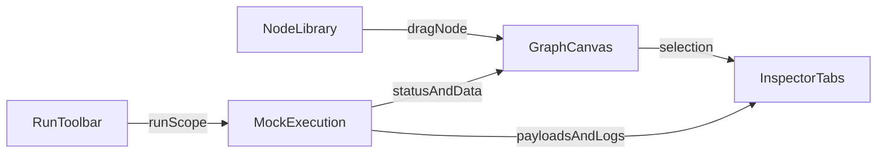

# AI Video Workflow Builder Visual Design System

> **Scope:** Visual language and interaction patterns for a three-panel workflow builder with node cards, typed edges, a data inspector, and mock execution.
>
> **Stack target:** React, `@xyflow/react`, Tailwind CSS, shadcn/ui.
>
> **Default mode:** Dark.
>
> **Document status:** Final unified design system. This replaces the earlier multi-direction exploration.

## 1. Design Intent

This product should feel like a professional instrument panel for building and debugging AI video pipelines. The interface must remain legible at high density, calm under heavy state changes, and explicit about data flow, type compatibility, and execution status.

The design language should borrow from:

- Figma Dev Mode for panel hierarchy, inspection density, and token discipline
- n8n and ComfyUI for graph editing affordances, typed connections, and workflow mental models
- React Flow examples for implementation realism and interaction constraints

### UX Principles

1. **Signal over decoration**  
   Every accent color must mean something: selection, live execution, validation, or data type.

2. **Graph state should be glanceable**  
   A user should understand what is selected, what is runnable, what is invalid, and what just executed in under two seconds.

3. **Developer-first density**  
   Prefer compact metadata, monospace readouts, explicit IDs, and keyboard affordances over oversized cards and ornamental chrome.

4. **One selection model**  
   The left panel populates the canvas, the center canvas owns primary selection, and the right inspector reflects that selection immediately.

5. **Typed connections must feel trustworthy**  
   Ports, edges, badges, and previews should make type compatibility obvious before a user commits a connection.

6. **Execution should be readable, not theatrical**  
   Execution feedback should be visible enough to follow traversal, but never so animated that it becomes distracting during iterative debugging.

## 2. Product Frame And Constraints

### Layout

- **Left panel:** searchable, categorized, draggable node library
- **Center panel:** React Flow canvas with custom node cards and typed edges
- **Right panel:** inspector with tabs for `Config`, `Preview`, `Data`, `Validation`, and `Metadata`
- **Top of center panel:** run toolbar with `Run Workflow`, `Run Node`, `Run From Here`, and `Cancel`

### Technical Constraints

- Use shadcn/ui semantics and primitives wherever possible
- Map colors through CSS variables so React Flow nodes, SVG edges, and shadcn components share one token system
- Keep surfaces and states expressible through Tailwind utilities plus a small set of custom variables
- Assume long sessions, large graphs, and data-heavy inspector content

### Information Architecture



## 3. Unified Design Direction

This interface should be a single coherent system, not multiple competing directions.

### Final Design Character

- Base mood: restrained, instrument-grade, dark neutral
- Accent behavior: cyan-blue for focus, selection, and valid interaction; amber reserved for execution and media cues
- Semantic colors: success, warning, and destructive only when communicating actual status
- Density: compact, with monospace metadata and minimal ornamental chrome
- Preview emphasis: strong enough to support video workflows without letting preview-heavy nodes dominate graph density

### Core Synthesis

- Use the structural discipline of a shadcn-native system
- Use industrial, explicit state treatment for node and edge behavior
- Use selective execution tracing and preview emphasis for run readability

## 4. Token System

Use shadcn/ui variable names as the base contract. Custom workflow tokens extend the system; they do not replace it.

### Core Theme Tokens

| Token | Purpose | Suggested Value |
|---|---|---|
| `--background` | App shell and canvas surround | `#0B0D12` |
| `--foreground` | Primary text and icons | `#E6EAF2` |
| `--card` | Panels, node surfaces, popovers | `#11141B` |
| `--card-foreground` | Text on card surfaces | `#E6EAF2` |
| `--primary` | Selection, active tabs, focus accents | `#38BDF8` |
| `--primary-foreground` | Text on primary surfaces | `#06131C` |
| `--secondary` | Secondary buttons and segmented surfaces | `#1A2230` |
| `--secondary-foreground` | Text on secondary surfaces | `#D7DDEA` |
| `--muted` | Nested wells, code blocks, inactive shells | `#151A22` |
| `--muted-foreground` | Secondary metadata and helper text | `#8A93A5` |
| `--accent` | Hover and active row fill | `#162433` |
| `--accent-foreground` | Text on accent surfaces | `#DCEBFA` |
| `--destructive` | Errors and invalid states | `#F43F5E` |
| `--destructive-foreground` | Text on destructive surfaces | `#FFF1F4` |
| `--border` | Dividers, card borders, rails | `#252B36` |
| `--input` | Form control border | `#2B3442` |
| `--ring` | Focus-visible ring | `#38BDF8` |

### Extension Tokens

| Token | Purpose | Suggested Value |
|---|---|---|
| `--signal` | Active execution and traversal | `#F59E0B` |
| `--success` | Passed and completed state | `#22C55E` |
| `--warning` | Caution and degraded state | `#F59E0B` |

### Node Category Accent Tokens

Category color should appear only as a subtle accent line, icon tint, or tiny badge edge.

| Category | Accent Direction |
|---|---|
| Input | slate / neutral |
| Script | blue |
| Visuals | violet |
| Audio | teal |
| Video | amber |
| Utility | gray |
| Output | emerald |

### Tone Rules

- Category color never replaces selection color
- Selection must stay obvious through ring and border, not color alone
- Error state overrides category accents where necessary
- Disabled and stale states desaturate category accents
- Do not use large gradients or full-card semantic fills for normal graph states

## 5. Typography, Shape, And Spacing

### Typography

- Sans: Geist or a comparable neutral tooling-oriented sans
- Mono: Geist Mono or JetBrains Mono
- Base UI density: `text-xs` and `text-sm`
- Section labels: uppercase, `tracking-wide`, `text-[10px]`
- IDs, timestamps, JSON, payload types, port labels, and telemetry are monospace
- Numeric telemetry should use tabular numerals

### Shape

- Panels: `rounded-lg` only where panel framing helps
- Node cards: `rounded-md`
- Inputs, chips, compact controls: `rounded-sm` to `rounded-md`
- Borders carry hierarchy; shadows are secondary
- Noticeable elevation is reserved for dragging, popovers, and dialogs

### Spacing

- Panel rhythm: `12px` / `16px`
- Metadata rows and compact chips: `8px`
- Node internals: `12px`
- Toolbar height: `48px`
- Sticky tab bars and headers should preserve clear 1px separation lines

## 6. Responsive Layout And Resizing

### Baseline Widths

- Left panel: `280px` default, `240px` min, `360px` max
- Right panel: `400px` default, `320px` min, `480px` max
- Center canvas fills the remainder

### Resize Behavior

- Panel widths are user-resizable
- Width preferences persist per user
- Resize handles should have a `10px` hit area even if the visible divider is only `1px`
- Double-click on a resize handle resets the panel to its default width

### Breakpoints

- Below `1280px`: either side panel may collapse to an icon rail
- Below `1024px`: only one side panel should remain open by default
- Below `768px`: default to read-only graph viewing unless a dedicated mobile editing flow exists

### Collapse Rules

- Collapsing a panel preserves its previous width
- Inspector keeps its active tab when reopened
- Toolbar remains fixed and usable regardless of panel collapse state
- Canvas panning and selection behavior must not shift unexpectedly when panels open or close

## 7. Layering And Z-Index

Use a fixed stack so graph interactions remain predictable.

| Layer | z-index |
|---|---|
| Canvas background and grid | `0` |
| Base edges | `1` |
| Hovered or selected edges, connection previews | `2` |
| Nodes | `3` |
| Selected or dragging nodes | `4` |
| Edge labels and inline type badges | `5` |
| Resize handles and canvas-local overlays | `10` |
| Dropdowns, context menus, popovers | `20` |
| Tooltips | `30` |
| Dialog scrim and modal surfaces | `40` |
| Toasts | `50` |

### Layering Rules

- Tooltips must always sit above menus and canvas overlays
- Edge labels should never block port interaction
- Drag ghosts should appear above nodes and edges, below dialogs
- Connection preview lines should sit above base edges, below popovers and tooltips

## 8. Motion And Transition Rules

### Timing

- Hover transitions: `120ms ease-out`
- Focus and selection transitions: `150ms ease-out`
- Tab content transitions: `160ms ease-out`
- Inspector data refresh pulse: `180ms ease-out`
- Execution edge traversal: `900ms linear` repeating while active
- Running status dot pulse: `1200ms ease-in-out` repeating while active
- Skeleton shimmer: `1400ms linear` repeating

### Motion Principles

- No scale animation on focus-visible states
- Prefer opacity, border, and ring changes over size changes
- Execution animation should emphasize path order, not spectacle
- Success settle animations should be brief and fade back to resting UI

### Reduced Motion

If `prefers-reduced-motion` is enabled:

- Remove shimmer, traveling dots, and animated edge dashes
- Keep only brief opacity or color transitions at `80ms`
- Replace execution animation with static active highlighting and timestamp updates
- Avoid auto-scrolling the inspector to changed content

## 9. Node Library

### Layout

- Fixed left rail
- Sticky search at the top
- Category list in a scroll area below
- Optional footer hint row for shortcuts or drag guidance

### Library Item Anatomy

- Icon
- Node title
- One-line type or category metadata
- Optional badge for `New`, `Video`, `Core`, or `Beta`
- Optional drag affordance icon on hover

### States

- Default
- Hover
- Focus-visible
- Keyboard-highlighted
- Dragging
- Disabled
- Empty search
- Loading
- Readonly

### Interaction Patterns

- Search filters immediately with light debounce
- Categories can collapse
- Drag starts from item body or drag handle
- Arrow keys move through visible library items
- `Enter` inserts the focused library item only when the library owns focus
- `A` opens the quick-add node menu from anywhere that is not a text input, dialog field, or contenteditable surface

### Tooltip Content

- Drag handle: `Drag to canvas`
- Disabled item: `Unavailable in current workflow scope`
- Beta badge: `Experimental node`
- Readonly state: `Editing is disabled`

## 10. Node Cards

### Anatomy

1. Header row with subtle category accent, icon, title, status dot, and quick menu
2. Subtitle row with node type, model, or provider
3. Optional inline badges for modality, preview, validation, or stale state
4. Left and right port rails
5. Footer metadata row for duration, resolution, cost, or warning summary

### Category Accent Treatment

- Use a `2px` header line or `3px` inset accent bar
- Tint the icon softly with the category color
- Keep category accents at subdued opacity
- Do not use full-card fills for category identity

### States

- Default
- Hover
- Focus-visible
- Selected
- Dragging
- Disabled
- Readonly
- Queued
- Running
- Success
- Warning
- Error
- Stale-data
- Mock-preview-available
- Blocked-by-invalid-input
- Multi-select summary

### State Rules

- Default: `bg-card border-border`
- Hover: stronger border and visible handles
- Focus-visible: `ring-2 ring-ring`
- Selected: `ring-2 ring-primary border-primary/40`
- Dragging: elevated z-index, stronger shadow, slight opacity reduction
- Disabled: lower contrast, muted handles, no active hover affordance
- Running: thin amber left rule plus animated state dot
- Success: compact semantic badge, no full-card green tint
- Warning: compact amber badge or footer chip
- Error: destructive border emphasis and readable error badge
- Stale-data: dashed outline and stale badge
- Preview available: compact chip or thumbnail affordance only if density allows

### Loading And Async States

- Newly inserted node may show skeleton subtitle while schema loads
- Config updates can show inline footer spinner
- Preview-capable nodes without output should show `No preview yet`
- Config changes that invalidate output should mark preview and data as stale immediately

### Tooltip Content

- Preview badge: `Latest mock output available`
- Stale badge: `Output no longer matches current configuration`
- Warning badge: `Non-blocking issue`
- Blocked state: `Resolve validation issues to run this node`

### Tailwind Example

```tsx
<div
  className="group relative w-[280px] rounded-md border border-border bg-card text-card-foreground shadow-sm transition-[border-color,box-shadow,opacity,transform] duration-150 ease-out hover:border-foreground/20 focus-within:ring-2 focus-within:ring-ring data-[selected=true]:border-primary/50 data-[selected=true]:ring-2 data-[selected=true]:ring-primary/70 data-[dragging=true]:opacity-95 data-[dragging=true]:shadow-lg data-[disabled=true]:opacity-55"
  data-testid="node-card-node_42"
  data-selected="true"
>
  <div className="absolute inset-x-0 top-0 h-0.5 rounded-t-md bg-blue-400/70" aria-hidden="true" />
  <div className="flex items-start gap-2 px-3 pb-2 pt-3">
    <div className="mt-0.5 text-blue-300" aria-hidden="true" />
    <div className="min-w-0 flex-1">
      <div className="flex items-center gap-2">
        <h3 className="truncate text-sm font-medium">Transcribe Audio</h3>
        <span className="h-2 w-2 rounded-full bg-[color:var(--signal)] data-[running=true]:animate-pulse" />
      </div>
      <p className="truncate font-mono text-[11px] text-muted-foreground">SCRIPT · whisper-large-v3</p>
    </div>
    <button className="rounded-sm p-1 text-muted-foreground hover:bg-accent hover:text-accent-foreground focus-visible:outline-none focus-visible:ring-2 focus-visible:ring-ring" data-testid="node-menu-btn-node_42" />
  </div>
  <div className="px-3 pb-2">
    <div className="flex flex-wrap gap-1">
      <span className="rounded-sm border border-border bg-muted px-1.5 py-0.5 text-[10px] font-medium uppercase tracking-wide">Preview</span>
      <span className="rounded-sm border border-amber-400/30 bg-amber-400/10 px-1.5 py-0.5 text-[10px] font-medium text-amber-200">Queued</span>
    </div>
  </div>
  <div className="border-t border-border px-3 py-2 font-mono text-[11px] text-muted-foreground">
    12.4s · 1080p · 312 frames
  </div>
</div>
```

## 11. Typed Edges

### Final Rules

- Use neutral edges by default
- Use line style first, color second
- Keep permanent edge colors quiet; rely on label pills, hover, and execution traces for emphasis
- Distinguish control flow from data flow even in grayscale

### Type Encoding

- `VIDEO`: amber-labeled pill
- `AUDIO`: teal-labeled pill
- `IMAGE/FRAME`: blue-cyan-labeled pill
- `DATA/JSON`: violet-labeled pill
- `CONTROL`: neutral dashed treatment

### States

- Default
- Hover
- Selected
- Valid connection preview
- Invalid connection preview
- Active execution
- Success settle
- Error
- Disabled
- Blocked
- Readonly
- Edge-selected

### State Rules

- Default: `1.5px` neutral stroke
- Hover: brighter edge and label reveal
- Selected: `2px` primary stroke
- Valid preview: primary or cyan ghost path
- Invalid preview: destructive dotted path with explanatory tooltip
- Active execution: animated amber or cyan trace
- Success: brief semantic flash, then return to neutral
- Error: destructive marker or midpoint icon
- Disabled or blocked: low-opacity dash

### Tooltip Content

- Valid target: `Compatible: VIDEO -> VIDEO`
- Invalid target: `Incompatible: expected AUDIO`
- Blocked edge: `Upstream node has blocking validation issues`
- Error marker: `Last run failed here`

### Tailwind Example

```tsx
<BaseEdge
  path={edgePath}
  className="stroke-border/80 transition-[stroke,stroke-width,opacity] duration-150 ease-out data-[hovered=true]:stroke-foreground/70 data-[selected=true]:stroke-primary data-[invalid=true]:stroke-destructive data-[running=true]:stroke-[color:var(--signal)]"
  style={{ strokeWidth: selected ? 2 : 1.5, strokeDasharray: isControl ? '6 4' : undefined }}
/>

<div
  className="rounded-sm border border-border bg-card/95 px-1.5 py-0.5 font-mono text-[10px] uppercase tracking-wide text-muted-foreground shadow-sm backdrop-blur data-[type=video]:border-amber-400/40 data-[type=video]:text-amber-200 data-[type=audio]:border-teal-400/40 data-[type=audio]:text-teal-200 data-[type=data]:border-violet-400/40 data-[type=data]:text-violet-200"
  data-testid="edge-edge_17"
>
  VIDEO
</div>
```

## 12. Inspector

### Shell

- Fixed-width right panel with sticky header and sticky tab list
- Scroll only inside tab content
- Header always shows selected item title and ID
- Edge selection may use the same shell with edge-specific content if supported

### Width

- Default `400px`
- Minimum `320px`
- Maximum `480px`
- Collapses to icon rail below `1280px`
- Becomes a slide-over drawer below `1024px` if necessary

### Common States

- No selection
- Loading selection schema
- Ready
- Dirty
- Saving
- Run in progress
- Readonly
- Error loading selection details

### Focus And Behavior

- Selection changes update inspector immediately without layout shift
- If the user is viewing `Preview` or `Data`, new values update in place
- If selected content is deleted, focus returns to the canvas and inspector resets to empty state
- Sticky footer actions remain visible in `Config` when edits are pending

### Tailwind Example

```tsx
<aside
  className="flex h-full w-[400px] min-w-[320px] max-w-[480px] flex-col border-l border-border bg-card text-card-foreground"
  data-testid="inspector"
>
  <div className="sticky top-0 z-10 border-b border-border bg-card/95 px-4 py-3 backdrop-blur">
    <div className="flex items-center justify-between gap-2">
      <div className="min-w-0">
        <h2 className="truncate text-sm font-medium">Frame Interpolator</h2>
        <p className="truncate font-mono text-[11px] text-muted-foreground">node_42</p>
      </div>
    </div>
  </div>
  <Tabs className="flex min-h-0 flex-1 flex-col">
    <TabsList className="grid grid-cols-5 rounded-none border-b border-border bg-card px-2 py-1" data-testid="inspector-tabs" />
    <div className="min-h-0 flex-1 overflow-auto bg-card px-4 py-4" />
  </Tabs>
</aside>
```

### Config Tab

- Group fields into `Inputs`, `Runtime`, `Model`, `Output`, and `Advanced`
- Use compact shadcn controls
- Helper text should explain effects, not restate labels
- Sticky footer contains `Apply`, `Reset`, and `Run Node`
- Dirty state appears both in header and footer
- Required-field and invalid-upstream states must disable run affordances

### Preview Tab

- Use a 16:9 panel at the top
- Show transport and zoom controls only when preview exists
- Show metadata directly beneath preview
- Loading state preserves frame and layout
- Stale preview may remain visible but dimmed, with a `Stale preview` chip
- If node cannot emit preview media, show a clear unsupported state

### Data Tab

- Subviews: `Input`, `Output`, `Context`
- Monospace JSON inside a muted code surface
- Copy, download, filter, and collapse controls above content
- Large payloads should lazy-render or virtualize
- If payload is truncated, show explicit expansion affordance

### Validation Tab

- Summary row with issue counts
- Group by severity and scope
- Each issue includes code, short explanation, and jump target if possible
- Empty state reads `No blocking issues`

### Metadata Tab

- Two-column key-value grid
- Includes node ID, type version, run timestamps, lineage, mock execution provenance, and source template details if present
- Copyable values should look clearly interactive

## 13. Run Toolbar

### Layout

- Left: workflow name, dirty state, environment tag
- Center: segmented run actions
- Right: status chip, timer, last-run or active-run ID

### States

- Idle
- Ready
- Partial-selection
- Running-workflow
- Running-single-node
- Running-from-here
- Cancelling
- Success
- Warning
- Failed
- Readonly
- Dirty-with-unsaved-changes

### Behavior

- `Run Workflow` remains primary
- `Run Node` and `Run From Here` enable only when selection supports them
- `Cancel` becomes prominent only during an active run
- Status chip always describes scope
- Dirty state must remain visible during runs
- If user runs with unsaved local changes, indicate `Running from unsaved local state`

### Tooltip Content

- Run Workflow: `Run the full workflow`
- Run Node: `Run the selected node`
- Run From Here: `Run downstream from current selection`
- Cancel: `Stop active execution`
- Dirty indicator: `Unsaved local snapshot`
- Export: `Export workflow as JSON`

### Tailwind Example

```tsx
<header
  className="sticky top-0 z-10 flex h-12 items-center justify-between gap-3 border-b border-border/80 bg-background/95 px-3 text-foreground backdrop-blur supports-[backdrop-filter]:bg-background/80"
  data-testid="run-toolbar"
>
  <div className="flex min-w-0 items-center gap-2">
    <span className="truncate text-sm font-medium">Marketing Clip Pipeline</span>
    <span className="rounded-sm border border-amber-400/30 bg-amber-400/10 px-1.5 py-0.5 text-[10px] font-medium text-amber-200" data-testid="workflow-dirty-indicator">Unsaved</span>
  </div>
  <div className="flex items-center gap-2">
    <button className="inline-flex h-8 items-center rounded-md bg-primary px-3 text-sm font-medium text-primary-foreground transition-colors hover:bg-primary/90 focus-visible:outline-none focus-visible:ring-2 focus-visible:ring-ring" data-testid="run-btn-workflow">Run Workflow</button>
    <button className="inline-flex h-8 items-center rounded-md border border-input bg-secondary px-3 text-sm text-secondary-foreground hover:bg-accent focus-visible:outline-none focus-visible:ring-2 focus-visible:ring-ring disabled:opacity-50" data-testid="run-btn-node">Run Node</button>
    <button className="inline-flex h-8 items-center rounded-md border border-input bg-secondary px-3 text-sm text-secondary-foreground hover:bg-accent focus-visible:outline-none focus-visible:ring-2 focus-visible:ring-ring disabled:opacity-50" data-testid="run-btn-from-here">Run From Here</button>
  </div>
  <div className="flex items-center gap-2">
    <span className="inline-flex items-center gap-1 rounded-md border border-border bg-muted px-2 py-1 text-[11px] font-mono text-muted-foreground" data-testid="run-status-chip">Idle</span>
  </div>
</header>
```

## 14. Empty, Loading, And Error States

### Empty States

- Canvas first use: dashed dropzone with `Add first node`
- No node selected: compact inspector guidance
- No preview yet: 16:9 muted frame with prompt to run node
- No data yet: muted code surface with disabled copy controls
- No validation issues: one-line positive state
- Empty library search: icon with `Clear filters`
- No execution history: quiet prompt to run mock execution

### Loading States

- Library loading: item skeletons that match row height
- Inspector loading: sticky header stays visible while form rows skeletonize
- Preview loading: skeleton frame with preserved aspect ratio
- Data loading: code-block skeleton with visible toolbar actions
- Validation recompute: summary row placeholder with stable layout
- Run startup: toolbar chip shows `Starting...`
- Cancelling: toolbar chip shows `Stopping...`, interrupted nodes are distinct from failed nodes

### Error States

- Preview error: `Preview unavailable` with retry
- Data load error: `Unable to load output payload`
- Validation service error: non-blocking alert in `Validation`
- Save snapshot error: toast plus persistent warning chip
- Export error: inline destructive alert with retry

## 15. Interaction Patterns

### Selection Model

- Clicking a node selects the node and updates the inspector
- Clicking an edge selects the edge and may show edge-specific inspector content
- Clicking empty canvas clears selection
- Multi-select uses marquee or modifiers, but inspector stays anchored to a primary item or multi-select summary
- The canvas is the source of truth for graph selection

### Drag And Drop

- Dragging from library into canvas shows placement ghost
- Valid drop zones may highlight subtly
- After drop, node becomes selected and inspector switches to `Config`
- Drag ghost should preserve icon and node title

### Port Hover And Connection Preview

- Hovering a handle reveals type label and compatibility hint
- Dragging from a source handle emphasizes compatible targets
- Invalid targets dim and show explanatory tooltip on hover
- Connection preview line communicates valid vs invalid before release
- `C` opens a searchable connect dialog from the selected node or port

### Inspector Synchronization

- Selection changes update inspector immediately without panel jitter
- `Preview` and `Data` update in place during runs
- Changes should animate lightly at the row or timestamp level, not by replacing entire panels
- If a selected edge or node disappears, focus should recover cleanly

### Mock Execution Playback

- Traversal animates edge-by-edge and node-by-node in order
- Active nodes show running state
- Completed nodes settle into success, warning, or error badges
- Payload updates appear in `Data` and `Preview` with timestamps
- Cancel marks interrupted nodes differently from failed nodes

## 16. Keyboard Patterns

These shortcuts are the documented product contract and must match exactly.

| Shortcut | Action |
|---|---|
| `Cmd/Ctrl+S` | Save committed local snapshot |
| `Cmd/Ctrl+Shift+E` | Export workflow JSON |
| `Cmd/Ctrl+Z` | Undo |
| `Cmd/Ctrl+Shift+Z` | Redo |
| `Backspace/Delete` | Delete selection |
| `Space` | Pan mode while held |
| `A` | Quick-add node command menu |
| `Enter` | Inspect selected item |
| `R` | Run selected node |
| `Shift+R` | Run workflow |
| `C` | Connect from selected node or port via searchable dialog |
| `Escape` | Clear selection / close menus |

### Shortcut Precedence Rules

1. Open dialogs and modals consume keys first
2. Then open menus and searchable overlays
3. Then active text inputs, textareas, and contenteditable regions
4. Then inspector body interactions
5. Then library navigation
6. Then canvas-level commands

### Implementation Rules

- `Cmd/Ctrl+S` must call `preventDefault()` so the browser does not intercept save
- `Space` only enters pan mode when the canvas owns focus and no text-editing surface is active
- `Enter` inspects selection only when the canvas owns focus and no higher-priority surface is active
- `Backspace/Delete` deletes graph selection only; never delete text from focused inputs via graph handlers
- `Escape` closes the topmost dismissible UI first, then clears selection if nothing else is open
- `R`, `Shift+R`, and `C` require immediate visible feedback in the toolbar or dialog shell

## 17. Accessibility

### Focus And Keyboard

- Every interactive element must have a visible `focus-visible` treatment
- Nodes and edges should be keyboard-focusable through React Flow accessibility settings
- Focus should return predictably after closing dialogs, menus, or inspectors
- The graph should expose a clear accessible name such as `Workflow canvas`

### Screen Readers

- Nodes should announce title, category, validation state, and run state
- Edges should announce source, target, and type
- Inspector tabs should announce tab name and active state
- The app should use a polite live region for major run events

Suggested live region announcements:

- `Run started`
- `Node Transcribe Audio completed`
- `Workflow failed at edge edge_17`
- `Run cancelled`

### Contrast

- All primary and secondary text should meet WCAG AA
- Category accents are supplemental, not sole carriers of meaning
- Selected, running, invalid, and disabled states must remain distinguishable even with limited saturation

### Reduced Motion

- Respect `prefers-reduced-motion`
- Avoid perpetual motion except during actual active state
- Replace moving dashes and shimmer with static active highlight where needed

### Hit Targets

- Resize handles: minimum `10px` interactive width
- Icon buttons: minimum `32px` hit area
- Port handles: larger invisible hit box than the visible handle

## 18. data-testid Strategy

### Naming Rules

- Use stable semantic IDs, not array indexes
- Prefer kebab-case prefixes with object IDs or keys
- Keep base test IDs state-agnostic; use data attributes for state
- Avoid duplicating IDs for the same element under different modes

### Examples

- `data-testid="node-card-{nodeId}"`
- `data-testid="node-port-in-{nodeId}-{portKey}"`
- `data-testid="node-port-out-{nodeId}-{portKey}"`
- `data-testid="edge-{edgeId}"`
- `data-testid="edge-label-{edgeId}"`
- `data-testid="inspector"`
- `data-testid="inspector-tab-{tabName}"`
- `data-testid="run-toolbar"`
- `data-testid="run-btn-workflow"`
- `data-testid="run-btn-node"`
- `data-testid="run-btn-from-here"`
- `data-testid="run-btn-cancel"`
- `data-testid="workflow-save-btn"`
- `data-testid="workflow-export-btn"`
- `data-testid="node-search-input"`
- `data-testid="quick-add-dialog"`
- `data-testid="connect-dialog"`
- `data-testid="panel-resize-left"`
- `data-testid="panel-resize-right"`
- `data-testid="canvas-empty-cta"`
- `data-testid="validation-item-{issueCode}"`
- `data-testid="toast-run-error"`

### State Attributes

Prefer data attributes for queryable state:

- `data-selected="true"`
- `data-running="true"`
- `data-invalid="true"`
- `data-stale="true"`
- `data-readonly="true"`

## 19. References And What To Borrow

### Figma

- [Figma Dev Mode](https://www.figma.com/dev-mode)  
  Borrow structured inspector hierarchy, dense property grouping, and developer-facing precision.

- [Working in Dev Mode](https://developers.figma.com/docs/plugins/working-in-dev-mode/)  
  Borrow code-adjacent framing for values and spacing.

### ComfyUI And n8n

- [ComfyUI Interface Overview](https://docs.comfy.org/interface/overview)  
  Borrow the left-sidebar plus graph plus right-properties composition.

- [ComfyUI Interface Exploration Tutorial](https://comfyui.org/en/interface-exploration-tutorial)  
  Borrow the centrality of graph editing and node-inspection flow.

- [n8n Canvas-Only Mode Commit](https://github.com/n8n-io/n8n/commit/f3b4069a090d6bf5797991cbec717f522b0778dc)  
  Borrow the principle that the canvas deserves visual dominance during workflow editing.

### React Flow

- [React Flow Dark Mode Example](https://reactflow.dev/examples/styling/dark-mode)  
  Borrow baseline canvas contrast expectations.

- [React Flow Custom Nodes Guide](https://reactflow.dev/docs/guides/custom-nodes)  
  Borrow the implementation model for node cards, handles, and custom states.

## 20. Build Handoff

### Tailwind And CSS Variable Recommendations

- Define tokens in `:root` and `.dark`
- Keep shadcn/ui semantic token names intact
- Extend Tailwind only for `signal`, `success`, and `warning` if needed
- Prefer semantic utility classes over arbitrary color values

### shadcn/ui Primitives To Reuse

- `Tabs`
- `ScrollArea`
- `Button`
- `Badge`
- `Tooltip`
- `Separator`
- `Accordion`
- `Alert`
- `Input`
- `Select`
- `DropdownMenu`
- `Dialog`
- `Command`
- `ToggleGroup`
- `Resizable` primitives if panel resizing is enabled

### React Flow Customization Surfaces

- `nodeTypes` for workflow-specific node cards
- `edgeTypes` for typed, selectable, animated, and validation-aware edges
- `defaultEdgeOptions` for consistent markers and interaction width
- `Background` for a low-contrast grid or dot pattern
- `MiniMap` and `Controls` restyled to match dark tooling surfaces
- `Panel` overlays for canvas-local status or legends
- Accessibility props enabled for focusable nodes and edges

### Risks To Validate During Implementation

- Edge readability in dense graphs
- Contrast of muted text against dark surfaces
- Clarity between selected, running, stale, and invalid states
- Performance cost of execution tracing
- Rendering of large JSON payloads
- Preventing preview-heavy nodes from bloating graph density
- Making keyboard interactions feel native, not bolted on

## 21. Final Recommendation In One Sentence

Build a restrained, developer-first dark workflow editor with shadcn-native structure, explicit typed-state feedback, subtle category accents, and low-noise execution tracing so the graph stays calm at rest and highly legible during runs.
